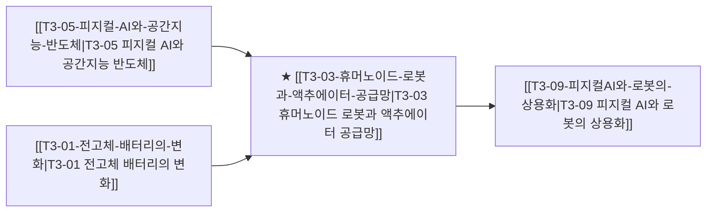

# T3-03 휴머노이드 로봇과 액추에이터 공급망

> 🧭 **상위 인덱스**: [[00-Argus-Master-MOC|Master MOC]] ➔ [[00-Argus-Master-MOC#3-🤖-피지컬-ai-로보틱스--엣지-디바이스-physical-ai--edge|피지컬 AI & 엣지 디바이스]]

> 🏷️ **교차 분석 메타데이터**:
> - **성격**: `🚀 주류 성장 (Consensus)` | **스택**: `L5 (디바이스)` | **시계**: `2027~2029`
> - **공급망 권역**: `US`, `KR` | **핵심 대결 구도**: 해당 없음

---

## 🎯 핵심 가설
테슬라 옵티머스 등 3세대 휴머노이드 로봇이 공장 파일럿에 투입되며 고정밀 감속기·하모닉 드라이브 부품 수요가 급증한다

---

## 🔗 테제 네트워크 (상호 연관 가설)



- 🔼 **선행 가설 (배경 요인 & 상위 인프라)**:
  - [[T3-05-피지컬-AI와-공간지능-반도체|T3-05 피지컬 AI와 공간지능 반도체]] — 비전·물리 모델 결합
  - [[T3-01-전고체-배터리의-변화|T3-01 전고체 배터리의 변화]] — 로봇용 고출력 배터리
- ➡️ **동반 및 대체·경쟁 가설**:
  - (해당 없음)
- 🔽 **파생 및 후행 병목 가설**:
  - [[T3-09-피지컬AI와-로봇의-상용화|T3-09 피지컬 AI와 로봇의 상용화]] — 제조·물류 현장 투입 양산

---

## 🏢 연관 기업 & 핵심 기술 허브
- **핵심 기업**: [[Company-Tesla|Tesla]], [[Company-레인보우로보틱스|레인보우로보틱스]], [[Company-두산로보틱스|두산로보틱스]], [[Company-에스피지|에스피지]], [[Company-하모닉드라이브|하모닉드라이브]], [[Company-삼성전자|삼성전자]]
- **핵심 기술/토픽**: [[Topic-피지컬AI|피지컬AI]], [[Topic-자율주행|자율주행]]

---

## 📈 지지 근거


---

## 📉 반박 근거


---

## 📑 관련 산출물 (자동 집계)

### 🤖 Dataview 실시간 역방향 링크
```dataview
TABLE file.mtime AS "작성일", angle AS "관점", tags AS "태그"
FROM "argus" OR "output" OR ""
WHERE contains(thesis, "T2-03") OR contains(thesis, "T2-03") OR contains(file.outlinks, this.file.link)
SORT file.mtime DESC
LIMIT 7
```

### 📌 수동 링크 아카이브


---

## 📝 분석가 메모


## 지지 근거
- 2026-09-06: IFA2026에서 LG전자가 빅테크와 액추에이터 공급 협의를 진행한 것으로 관측됨

## 반박 근거
- 2026-09-06: 증권사 리포트 3건 모두 테슬라 옵티머스 공장 파일럿·고정밀 감속기/하모닉 드라이브 수요 급증 관련 언급이나 수치가 전무하고 LG전자 리포트는 오히려 매출 감소와 수익성 축소를 지적함