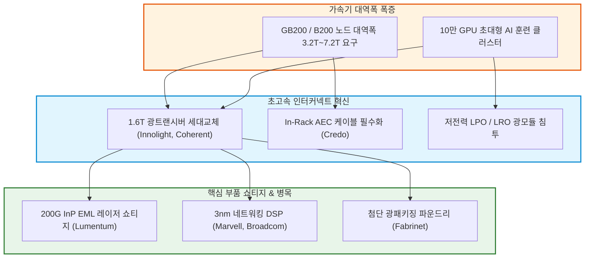

# T3-04 800G·1.6T 광트랜시버와 AEC·LPO 초고속 인터커넥트 혁신

> 🧭 **상위 인덱스**: [[00-Argus-Master-MOC|Master MOC]] ➔ [[00-Argus-Master-MOC#3-🌐-초고속-네트워킹--시스템-플랫폼-networking--systems|초고속 네트워킹 & 시스템 플랫폼]]

> 🏷️ **교차 분석 메타데이터**:
> - **레이어**: `L3` (초고속 네트워킹 & 광통신 패브릭)
> - **가설 성격**: `🚀 consensus (주류 성장)` — AI 클러스터 스케일아웃(Scale-Out)의 절대적 핵심 하드웨어
> - **투자 방향**: `bullish` (광모듈, EML 레이저, AEC 컨트롤러 공급망 수혜)

---

## 📌 가설 요약 (Executive Summary)
1. **800G에서 1.6T로의 급격한 광모듈 세대교체**:
   - 차세대 AI 가속기(B200, GB200, TPU v6 등)의 노드당 네트워크 대역폭이 3.2Tbps~7.2Tbps로 급증함에 따라, **1.6T(200G/Lane x 8) 광트랜시버**가 2025~2026년 글로벌 하이퍼스케일러의 표준 규격으로 안착하고 있습니다.
2. **구리선 한계 극복을 위한 AEC(Active Electrical Cable)의 랙 내부 장악**:
   - 패시브 구리선(DAC)은 100G/Lane 이상 고주파에서 신호 감쇄가 심해 도달 거리가 1m 미만으로 제한됩니다. 이에 따라 케이블 끝단에 리타이머 DSP를 내장하여 도달 거리를 3~5m로 늘리고 전력 소모를 광케이블 대비 50% 줄인 **AEC(Credo, Marvell 등)**가 랙 내부(In-Rack) 표준으로 급부상했습니다.
3. **저전력 혁신: LPO(Linear Pluggable Optics)의 부상**:
   - 광트랜시버 내부의 전력 소비 주범인 DSP를 제거하고 스위치 ASIC의 SerDes가 광소자를 직접 구동하는 **LPO/LRO 기술**이 전력 및 지연시간(Latency)을 획기적으로 줄이며 엔비디아 및 빅테크 데이터센터에 침투하고 있습니다.
4. **광통신 핵심 부품(EML 광원 & DSP)의 쇼티지 프리미엄**:
   - 200G급 InP(인듐인) EML 레이저 칩(Lumentum, Coherent)과 고성능 3nm 네트워킹 DSP(Marvell, Broadcom) 공급망이 초고마진 독점력을 행사하고 있습니다.

---

## 🕸️ 인과관계 다이어그램 (Mermaid Graph)



---

## 🔗 테제 간 연관관계 (Thesis Mapping)

- 🔼 **선행 인프라 및 프로토콜 가설**:
  - [[T3-02-초고속-AI-네트워킹-UEC-vs-인피니밴드|T3-02 초고속 AI 네트워킹 UEC vs 인피니밴드]] — 800G/1.6T 광트랜시버가 탑재되는 핵심 통신 패브릭
  - [[T3-06-초고다층-기판-MLB와-초저손실-CCL-병목|T3-06 초고다층 기판 MLB와 초저손실 CCL 병목]] — 800G/1.6T 스위치 메인보드 기판
- ➡️ **동반 및 상호 보완 가설**:
  - [[T3-10-NVLink-Switch-랙스케일-패브릭과-대규모-구리-백플레인|T3-10 NVLink 랙스케일 패브릭]] — 랙 내부 구리 백플레인과 랙 간 광트랜시버의 조화
  - [[T3-07-데이터센터-간-초장거리-인터커넥트-DCI|T3-07 메트로 DCI 광전송]] — 단거리(Intra-DC) 광모듈과 장거리(Inter-DC) 광통신의 연계
- 🔽 **차세대 전환 가설**:
  - [[T3-01-실리콘-포토닉스와-CPO의-상용화|T3-01 실리콘 포토닉스와 CPO의 상용화]] — 3.2T 이상에서 플러그형 광모듈(Pluggable)을 대체할 궁극의 광엔진 패키징

---

## 🏢 연관 기업 & 핵심 기술 허브
- **광트랜시버 모듈 1위**: [[Company-Innolight|Innolight (중지광전)]], [[Company-Coherent|Coherent]], [[Company-Fabrinet|Fabrinet (위탁양산)]]
- **레이저 광원(EML/CW) 독점**: [[Company-Lumentum|Lumentum]], [[Company-Coherent|Coherent]]
- **AEC & 네트워킹 DSP**: [[Company-Credo|Credo]], [[Company-Marvell|Marvell]], [[Company-Broadcom|Broadcom]]
- **핵심 기술/토픽**: [[Topic-초고속네트워킹|초고속네트워킹]], [[Topic-실리콘포토닉스|실리콘포토닉스]]

---

## 📈 지지 근거 (Bullish Arguments)
1. **1.6T 광트랜시버 출하 폭발**:
   - 2025~2026년 엔비디아 Quantum-X800 및 Spectrum-X800 스위치 출하와 함께 1.6T OSFP 광모듈 수요가 전년 대비 300% 이상 성장.
2. **AEC의 폭발적 침투**:
   - 구리선 대비 얇고 유연하며 도달 거리가 긴 AEC가 하이퍼스케일러 랙 내부 인터커넥트의 70% 이상을 석권.
3. **광원 칩 공급 부족 장기화**:
   - 200G EML 레이저 칩을 양산할 수 있는 기업이 Lumentum과 Coherent 등 소수에 불과하여 높은 단가(ASP)와 영업이익률 유지.

---

## 📉 반박 근거 및 위험 요인 (Bearish Risks)
1. **CPO(Co-Packaged Optics) 상용화 가속 시 플러그형 광모듈 잠식**:
   - 브로드컴, TSMC의 CPO 기술이 예상보다 빠르게 양산될 경우 기존 탈착식(Pluggable) 트랜시버 시장 규모 위축 위험.
2. **미중 지정학 제재 리스크**:
   - 중국계 광모듈 제조사(Innolight 등)에 대한 미국 상무부의 제재 가능성.

---

## 📑 관련 산출물 (자동 집계)

### 🤖 Dataview 실시간 역방향 링크
```dataview
TABLE file.mtime AS "작성일", angle AS "관점", tags AS "태그"
FROM "argus" OR "output" OR ""
WHERE contains(thesis, "T3-04") OR contains(file.outlinks, this.file.link)
SORT file.mtime DESC
LIMIT 7
```
