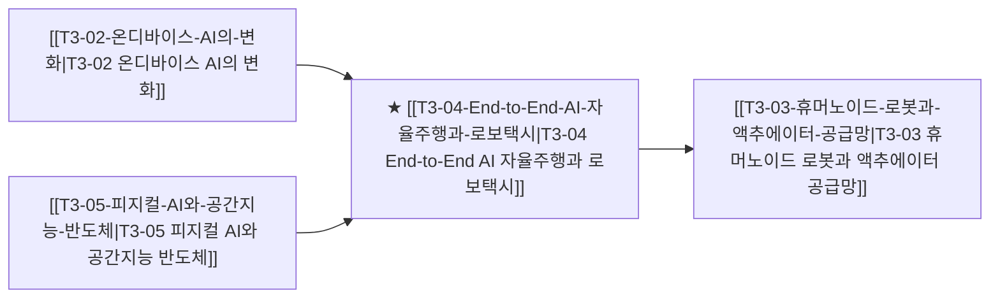

# T3-04 End-to-End AI 자율주행과 로보택시

> 🧭 **상위 인덱스**: [[00-Argus-Master-MOC|Master MOC]] ➔ [[00-Argus-Master-MOC#3-🤖-피지컬-ai-로보틱스--엣지-디바이스-physical-ai--edge|피지컬 AI & 엣지 디바이스]]

> 🏷️ **교차 분석 메타데이터**:
> - **성격**: `🚀 주류 성장 (Consensus)` | **스택**: `L5 (디바이스)` | **시계**: `2026~2027`
> - **공급망 권역**: `US`, `KR` | **핵심 대결 구도**: 해당 없음

---

## 🎯 핵심 가설
비전 기반 E2E 신경망(VLM/세계모델)의 완성으로 무인 로보택시 서비스가 대도시 단위로 본격 상용화된다

---

## 🔗 테제 네트워크 (상호 연관 가설)



- 🔼 **선행 가설 (배경 요인 & 상위 인프라)**:
  - [[T3-02-온디바이스-AI의-변화|T3-02 온디바이스 AI의 변화]] — 차량 내 실시간 추론 연산
  - [[T3-05-피지컬-AI와-공간지능-반도체|T3-05 피지컬 AI와 공간지능 반도체]] — VLA 기반 엔드투엔드 주행
- ➡️ **동반 및 대체·경쟁 가설**:
  - (해당 없음)
- 🔽 **파생 및 후행 병목 가설**:
  - [[T3-03-휴머노이드-로봇과-액추에이터-공급망|T3-03 휴머노이드 로봇과 액추에이터 공급망]] — 로보틱스 파운데이션 모델 공유

---

## 🏢 연관 기업 & 핵심 기술 허브
- **핵심 기업**: [[Company-Tesla|Tesla]], [[Company-Waymo|Waymo]], [[Company-현대차|현대차]], [[Company-우버|우버]], [[Company-모빌아이|모빌아이]], [[Company-Baidu|Baidu]]
- **핵심 기술/토픽**: [[Topic-자율주행|자율주행]], [[Topic-피지컬AI|피지컬AI]]

---

## 📈 지지 근거


---

## 📉 반박 근거


---

## 📑 관련 산출물 (자동 집계)

### 🤖 Dataview 실시간 역방향 링크
```dataview
TABLE file.mtime AS "작성일", angle AS "관점", tags AS "태그"
FROM "argus" OR "output" OR ""
WHERE contains(thesis, "T2-04") OR contains(thesis, "T2-04") OR contains(file.outlinks, this.file.link)
SORT file.mtime DESC
LIMIT 7
```

### 📌 수동 링크 아카이브


---

## 📝 분석가 메모

