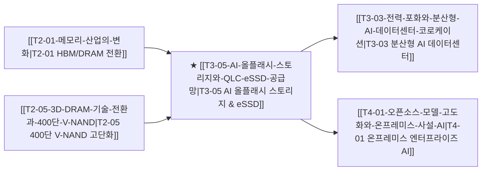

# T3-05 AI 올플래시 스토리지와 QLC eSSD 공급망

> 🧭 **상위 인덱스**: [[00-Argus-Master-MOC|Master MOC]] ➔ [[00-Argus-Master-MOC#3-🌐-초고속-네트워킹--시스템-플랫폼-networking--systems|초고속 네트워킹 & 시스템 플랫폼]]
> 
> 🏷️ **교차 분석 메타데이터**:
> - **성격**: `🚀 주류 성장 (Consensus)` | **스택**: `L3 (시스템스토리지)` | **시계**: `2026~2028`
> - **공급망 권역**: `US`, `KR` | **핵심 기업**: `Pure Storage`, `SK하이닉스(솔리다임)`, `삼성전자`

---

## 🎯 핵심 가설
AI 모델이 텍스트를 넘어 고해상도 이미지·영상 멀티모달로 확장되고 모델 파라미터가 조 단위에 진입함에 따라, 학습 중 데이터 공급 및 주기적 체크포인팅(Check-pointing) 시 심각한 I/O 병목(Storage Wall)이 발생한다. 이를 해소하기 위해 기존 HDD 기반 니어라인 스토리지가 고용량 60TB/120TB QLC eSSD 기반 초고속 분산 올플래시 어레이(AFA, All-Flash Array)로 전면 교체된다.

---

## 🔗 테제 네트워크 (상호 연관 가설)

- 🔼 **선행 가설**: [[T2-05-3D-DRAM-기술-전환과-400단-V-NAND|T2-05 400단 V-NAND 적층]]을 통한 고용량 QLC 칩셋 공급 안정화.
- 🔽 **후행 가설**: 온프레미스 사설 AI 구축 시 GPU 유휴 시간(Idling) 최소화를 위해 고성능 스토리지 필수 탑재.

---

## 💡 가설의 배경 및 핵심 동인

1. **AI I/O Wall(입출력 장벽)과 GPU 유휴 비용**:
   - 수만 개의 H100/B200 클러스터에서 노드 장애 시 직전 학습 상태로 복원하는 체크포인팅 시간이 수십 분 이상 소요될 경우 수백만 달러의 GPU 연산 자원이 낭비됨.
   - 초당 수십 테라바이트를 병렬로 읽고 쓰는 병렬 분산 파일시스템(NVMe-oF, GPUDirect Storage)이 필수적 인프라로 안착.
2. **QLC eSSD의 TCO 역전**:
   - 60TB 이상 초고용량 QLC eSSD의 단위 면적당 용량 및 소비전력이 기존 HDD 대비 5배 이상 우수해지며 전력 포화 상태인 AI 데이터센터에서 면적·전력 절감 효과 극대화.
3. **빅테크 및 티어2 CSP의 AFA 대량 채택**:
   - Meta, Microsoft뿐만 아니라 CoreWeave 등 네오클라우드가 Pure Storage(FlashBlade//S) 및 VAST Data 기반 올플래시 아키텍처를 기본 표준으로 채택 중.

---

## ⚖️ 지지 근거 vs 반박 요인

### 👍 지지 근거 (Bullish Factors)
- **SK하이닉스 솔리다임의 eSSD 흑자 전환 및 독주**: 60TB QLC eSSD 공급 부족 현상이 심화되며 엔터프라이즈 낸드 ASP 반등 주도.
- **Pure Storage의 엔터프라이즈 침투**: 전력 효율 중심의 직접 매핑 아키텍처(DirectFlash)로 AI 학습/추론 파이프라인에서 벤더 점유율 확대.
- **멀티모달 데이터 폭증**: 비디오 생성 AI 학습에 소요되는 비정형 데이터셋 규모가 엑사바이트(EB) 단위로 급증.

### 👎 반박 및 리스크 요인 (Bearish Factors)
- **낸드 원가 상승 시 하이브리드 지연**: 낸드 가격 급등 시 CAPEX 부담으로 HDD 티어링(Tiering) 시스템 유지 가능성.
- **자체 커스텀 스토리지 내재화**: 구글, AWS 등 초거대 하이퍼스케일러가 자체 분산 파일시스템을 고도화하여 상용 스토리지 벤더 마진 압박.

---

## 밸류체인 및 수혜 기업

| 영역 | 대표 기업 | 핵심 경쟁력 및 모멘텀 |
|:---|:---|:---|
| **AI 올플래시 스토리지** | **Pure Storage** | FlashBlade DirectFlash 모듈, 저전력 고밀도 AI 전용 스토리지 시장 선점 |
| **분산 데이터 플랫폼** | **VAST Data** | DASE(Disaggregated Shared Everything) 아키텍처 기반 초고속 AI 데이터 엔진 |
| **초고용량 QLC eSSD** | **SK하이닉스 (솔리다임)** | 60TB/120TB QLC eSSD 세계 시장 독점적 점유율, 엔비디아 추천 벤더 |
| **고성능 eSSD & 낸드** | **삼성전자** | 9세대 V-NAND 기반 PCIe Gen5 eSSD 공급 가속, 엔터프라이즈 라인업 강화 |
| **스토리지 네트워킹** | **NetApp** | 하이브리드 클라우드 데이터 관리 및 ONTAP AI 통합 인프라 |

---

## 🎯 검증 마일스톤 및 트리거

- **Catalyst Hit**: 빅테크 하이퍼스케일러의 120TB eSSD 표준 주문 개시 공시 (2026 H2).
- **Red Flag (기각 조건)**: 낸드 감산 완화 및 공급 과잉에 따른 판가 급락 또는 대용량 eSSD 수율 불안정 장기화.
