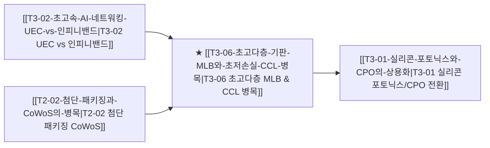

# T3-06 초고다층 기판 MLB와 초저손실 CCL 병목

> 🧭 **상위 인덱스**: [[00-Argus-Master-MOC|Master MOC]] ➔ [[00-Argus-Master-MOC#3-🌐-초고속-네트워킹--시스템-플랫폼-networking--systems|초고속 네트워킹 & 시스템 플랫폼]]
> 
> 🏷️ **교차 분석 메타데이터**:
> - **성격**: `🚀 주류 성장 (Consensus)` | **스택**: `L3 (네트워킹하드웨어)` | **시계**: `2026~2027`
> - **공급망 권역**: `KR`, `US`, `TW`, `JP` | **핵심 기업**: `이수페타시스`, `두산(전자BG)`, `Wus`

---

## 🎯 핵심 가설
인피니밴드 및 Ultra Ethernet 800G/1.6T 스위칭 장비와 엔비디아 GB200 NVLink 스위치 트레이의 고도화로 인해, 신호 무결성(Signal Integrity)과 열 관리를 위해 24층~38층에 달하는 초고다층 PCB(MLB, Multi-Layer Board) 및 저유전율·초저손실 동박적층판(Ultra Low-Loss CCL) 수요가 기하급수적으로 증가하며 공급망 병목이 심화된다.

---

## 🔗 테제 네트워크 (상호 연관 가설)

- 🔼 **선행 가설**: 800G/1.6T 초고속 스위치 포트 확장으로 메인보드 고다층화 필연.
- 🔽 **후행 가설**: 동박 배선의 전자기적 손실 한계 도달 시 CPO(T3-01)로의 기술 전이 가속.

---

## 💡 가설의 배경 및 핵심 동인

1. **포트 속도 증가에 따른 레이어 적층 수 급증**:
   - 400G 스위치 시절 18~22층이던 MLB 기판 층수가 800G 및 1.6T 스위치에서는 28~38층 이상으로 대폭 증가.
   - 층수가 올라갈수록 층간 정렬 오차와 도금 불량률이 지수함수적으로 증가하여 글로벌 공급 가능 벤더가 소수로 압축(Oligopoly).
2. **소재(CCL)의 극한 스펙 요구**:
   - 고주파 대역에서 신호 감쇠를 막기 위해 파나소닉(Megtron 시리즈), TUC, 두산(전자BG) 등 극소수 소재 기업의 최고등급 Low-Loss CCL 채택이 필수적.
3. **엔비디아 NVLink Switch Tray 수혜**:
   - GB200 NVL72 시스템의 핵심인 NVLink 스위치 보드 수량이 전작 대비 대폭 늘어나며 단위 랙당 MLB 투입 면적 및 판가(ASP) 폭등.

---

## ⚖️ 지지 근거 vs 반박 요인

### 👍 지지 근거 (Bullish Factors)
- **이수페타시스 등 선두권 MLB 업체의 장기 수주 및 CAPEX 증설**: 북미 빅테크(구글, 마이크로소프트, 엔비디아)향 고다층 기판 생산 라인 풀가동.
- **두산의 하이엔드 CCL 시장 침투**: 엔비디아 공급망 진입 및 고부가 네트워크 소재 믹스 개선.
- **진입 장벽**: 28층 이상 MLB 제조는 수율 확보에 수년이 걸려 후발 주자의 단기 시장 진입 불가.

### 👎 반박 및 리스크 요인 (Bearish Factors)
- **중국/대만계 경쟁사(Wus, Gold Circuit)의 캐파 추격**: 증설 완료 시 가격 경쟁 심화 우려.
- **CPO 조기 도입 시 구리 PCB 면적 축소**: 온보드 광학계 도입이 예상보다 빨라질 경우 고다층 구리 인터커넥트 수요 일부 잠식.

---

## 밸류체인 및 수혜 기업

| 영역 | 대표 기업 | 핵심 경쟁력 및 모멘텀 |
|:---|:---|:---|
| **초고다층 MLB 기판** | **이수페타시스** | 30층 이상 초고다층 글로벌 탑티어, 빅테크 스위치 및 가속기 메인보드 과점 |
| **초고다층 MLB 경쟁사** | **Wus Printed Circuit** | 대만/중국계 최대 MLB 업체, 시스코/엔비디아 주력 벤더 |
| **초저손실 동박적층판(CCL)** | **두산 (전자BG)** | 초저유전율 네트워크용 CCL 포트폴리오, 엔비디아 공급망 수혜 |
| **글로벌 CCL 선두** | **TUC (Taiwan Union)** | 고속 서버/스위치용 고주파 CCL 세계 1위권 벤더 |
| **원천 소재** | **파나소닉 (Panasonic)** | Megtron 7/8 초저손실 원천 소재 글로벌 표준 장악 |

---

## 🎯 검증 마일스톤 및 트리거

- **Catalyst Hit**: 1.6T 스위치 양산 스펙 확정 및 32층 이상 신규 MLB 수주 공시.
- **Red Flag (기각 조건)**: 경쟁사의 수율 급상승으로 인한 ASP(단가) 인하 압력 또는 빅테크 스위칭 설비투자 둔화.
