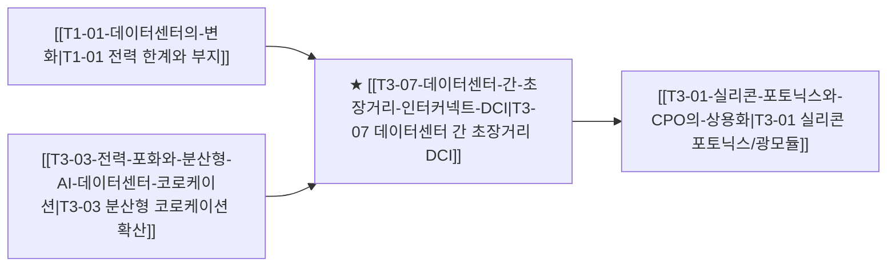

# T3-07 데이터센터 간 초장거리 인터커넥트 DCI

> 🧭 **상위 인덱스**: [[00-Argus-Master-MOC|Master MOC]] ➔ [[00-Argus-Master-MOC#3-🌐-초고속-네트워킹--시스템-플랫폼-networking--systems|초고속 네트워킹 & 시스템 플랫폼]]
> 
> 🏷️ **교차 분석 메타데이터**:
> - **성격**: `🚀 주류 성장 (Consensus)` | **스택**: `L3 (광네트워킹)` | **시계**: `2026~2028`
> - **공급망 권역**: `US`, `EU`, `JP` | **핵심 기업**: `Coherent`, `Lumentum`, `Ciena`

---

## 🎯 핵심 가설
단일 데이터센터 부지의 전력 공급 용량 한계(500MW~1GW 초과 불가)로 인해 메가스케일 AI 인프라가 10~100km 떨어진 복수의 캠퍼스로 분산 구축됨에 따라, 물리적으로 떨어진 GPU 랙들을 단일 슈퍼컴퓨터처럼 연결하는 800ZR/1.6T DCI(Data Center Interconnect) 코히런트(Coherent) 광트랜시버 및 DWDM 전송망 수요가 급성장한다.

---

## 🔗 테제 네트워크 (상호 연관 가설)

- 🔼 **선행 가설**: [[T3-03-전력-포화와-분산형-AI-데이터센터-코로케이션|T3-03 전력 분산 코로케이션]]으로 인한 원격지 간 초고속 데이터 셔틀 요구.
- 🔽 **후행 가설**: CPO 기술과의 융합을 통한 장거리·단거리 광전송 아키텍처 통합.

---

## 💡 가설의 배경 및 핵심 동인

1. **전력 그리드 병목이 부른 가상 클러스터링**:
   - 버지니아 노던, 아일랜드 등 글로벌 핵심 데이터센터 허브의 전력망 포화로 메가와트(MW) 단위 전력을 공급받기 위해 수십 킬로미터 떨어진 외곽에 건물을 분산 신축.
   - 분산된 건물의 GPU들이 모델 병렬화(Model Parallelism)를 유지하기 위해 마이크로초(µs) 단위 극저지연 광선로 연결이 절대적.
2. **800ZR / 800ZR+ 플러그형 코히런트 트랜시버의 등장**:
   - 과거 거대한 별도 광전송 장비(DWDM 샤시)가 필요했던 작업을 스위치 라우터에 직접 꽂는 플러그형 광모듈(QSFP-DD)로 축소하여 TCO 40% 이상 절감.
3. **빅테크 프라이빗 백본망 확대**:
   - 마이크로소프트, 메타, 구글이 자체 리전 내 데이터센터 간 연결을 위해 다크 파이버(Dark Fiber)를 대규모로 임차하고 800ZR 장비를 전면 포설 중.

---

## ⚖️ 지지 근거 vs 반박 요인

### 👍 지지 근거 (Bullish Factors)
- **Coherent, Lumentum 등 북미 광부품 선두사 실적 호조**: 800G 데이터통신(Datacom)에 이어 텔레콤/DCI 코히런트 라인업 수주 확대.
- **Innolight의 물량 독주**: 중국/동남아 생산 기지를 바탕으로 글로벌 하이퍼스케일러향 광트랜시버 공급 가속.
- **원격 추론 클러스터 연결**: 학습뿐 아니라 거대 모델 분산 추론 환경에서도 메트로 DCI 활용도 급증.

### 👎 반박 및 리스크 요인 (Bearish Factors)
- **빛의 속도 한계(물리적 지연시간)**: 거리가 100km를 초과할 경우 왕복 지연시간(RTT)이 증가하여 동기식(Synchronous) 학습 효율 급락 위험.
- **온사이트 자체 발전(SMR/가스터빈) 부상**: [[T1-08-온사이트-가스터빈과-연료전지-자체발전|T1-08 자체발전]] 확산 시 분산 대신 단일 부지 대용량 집적 가능성.

---

## 밸류체인 및 수혜 기업

| 영역 | 대표 기업 | 핵심 경쟁력 및 모멘텀 |
|:---|:---|:---|
| **광소자/광트랜시버 1위** | **Coherent** | 광 레이저 다이오드(InP), 광스위치, 코히런트 송수신기 수직계열화 |
| **코히런트 레이저 선도** | **Lumentum** | 하이엔드 EML/CW 레이저 및 통신사/DCI용 광모듈 점유율 최상위 |
| **글로벌 볼륨 벤더** | **Innolight (중지욱창)** | 압도적 생산능력으로 빅테크 800G/1.6T 광트랜시버 점유율 1위 |
| **광전송 시스템 장비** | **Ciena** | 글로벌 1위 광통신 네트워크 장비 업체, DCI 플랫폼 웨이브서버 공급 |
| **DCI DSP 칩셋** | **Marvell** | 800ZR 코히런트 DSP(ColorZ 시리즈) 시장 독점적 위치 |

---

## 🎯 검증 마일스톤 및 트리거

- **Catalyst Hit**: 글로벌 클라우드 CSP의 메트로 분산 클러스터링 800ZR 채택 공식화.
- **Red Flag (기각 조건)**: 장거리 분산 동기화 비효율로 인한 DCI 전송 인프라 CAPEX 축소.
