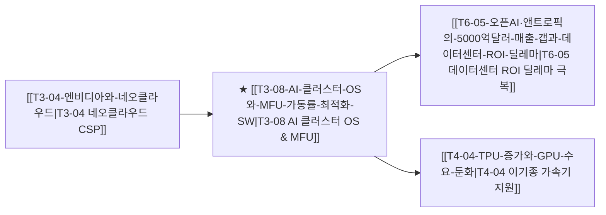

# T3-08 AI 클러스터 OS와 MFU 가동률 최적화 SW

> 🧭 **상위 인덱스**: [[00-Argus-Master-MOC|Master MOC]] ➔ [[00-Argus-Master-MOC#3-🌐-초고속-네트워킹--시스템-플랫폼-networking--systems|초고속 네트워킹 & 시스템 플랫폼]]
> 
> 🏷️ **교차 분석 메타데이터**:
> - **성격**: `🚀 주류 성장 (Consensus)` | **스택**: `L3 (시스템SW)` | **시계**: `2026~2027`
> - **공급망 권역**: `US`, `IL` | **핵심 기업**: `NVIDIA(Run:ai)`, `CoreWeave`, `Anyscale`

---

## 🎯 핵심 가설
수만~수십만 개의 가속기 노드가 병렬 연결된 초대형 AI 클러스터는 평균 수 시간마다 하드웨어 오류(GPU 번아웃, 케이블 불량, 메모리 에러)가 발생하여 전체 잡이 중단된다. 하드웨어 가동률(MFU, Model FLOPs Utilization)을 기존 30%대에서 50% 이상으로 끌어올리고 무중단 자동 체크포인팅/노드 재스케줄링을 수행하는 'AI 클러스터 OS' 및 분산 런타임 플랫폼이 데이터센터 ROI를 결정짓는 승부처가 된다.

---

## 🔗 테제 네트워크 (상호 연관 가설)

- 🔼 **선행 가설**: [[T3-04-엔비디아와-네오클라우드|T3-04 네오클라우드]]의 고효율 클러스터 자원 배분 경쟁.
- 🔽 **후행 가설**: [[T6-05-오픈AI·앤트로픽의-5000억달러-매출-갭과-데이터센터-ROI-딜레마|T6-05 5000억달러 매출 갭]] 극복을 위해 GPU 가동률(MFU) 개선을 통한 감가상각비 절감.

---

## 💡 가설의 배경 및 핵심 동인

1. **클러스터 대형화에 따른 '고장 빈도'의 기하급수적 증가**:
   - 10만 개 GPU 클러스터에서는 MTBF(평균 고장 간격)가 1~2시간에 불과.
   - 단 하나의 노드가 죽어도 전체 분산 훈련이 멈추는 동기식 병목을 해결하지 못하면 수천억 원의 전기료와 감가상각비가 허공으로 증발.
2. **엔비디아의 소프트웨어 해자 확장 (Run:ai 인수)**:
   - 엔비디아는 GPU 하드웨어 판매에 그치지 않고, 클러스터 스케줄링 선두사인 이스라엘의 Run:ai를 인수하여 쿠다(CUDA)와 엔비디아 AI 엔터프라이즈(NVAIE) 플랫폼으로 결합.
3. **오픈소스 분산 서빙/훈련 프레임워크의 진화**:
   - Ray(Anyscale), Slurm, vLLM, DeepSpeed 등 오픈 플랫폼들이 빅테크와 AI 스타트업의 필수 런타임 레이어로 자리매김.

---

## ⚖️ 지지 근거 vs 반박 요인

### 👍 지지 근거 (Bullish Factors)
- **클러스터 MFU 개선이 곧 수천억 원의 절감**: MFU를 35%에서 50%로 15%p만 올려도 필요한 GPU 수량이 30% 감소하여 Capex/Opex 동시 절감.
- **네오클라우드의 차별화 포인트**: CoreWeave, Lambda Labs 등이 AWS/Azure 대비 경쟁력을 갖는 핵심 이유가 가벼운 가상화 및 고속 인피니밴드 최적화 스케줄러 보유 덕분.

### 👎 반박 및 리스크 요인 (Bearish Factors)
- **클라우드 3사의 인하우스 내재화**: AWS(SageMaker HyperPod), Microsoft(Azure AI Cluster) 등 자체 오케스트레이션 고도화로 독립 솔루션 시장 위축 가능성.
- **Fault-tolerant 비동기 알고리즘 발전**: 하드웨어 고장에 구애받지 않는 비동기 모델 훈련 알고리즘이 개발될 경우 시스템 오케스트레이션 가치 일부 희석.

---

## 밸류체인 및 수혜 기업

| 영역 | 대표 기업 | 핵심 경쟁력 및 모멘텀 |
|:---|:---|:---|
| **GPU 클러스터 OS 선도** | **NVIDIA (Run:ai)** | 엔비디아 GPU 풀 가상화, 슬라이싱, 쿠버네티스 오케스트레이션 표준화 |
| **특화 네오클라우드** | **CoreWeave** | 베어메탈 인피니밴드 최적화 클러스터 관리 소프트웨어 보유 |
| **분산 파이썬/컴퓨팅** | **Anyscale (Ray)** | 초대형 모델 분산 서빙 및 파인튜닝 글로벌 표준 프레임워크 개발사 |
| **엔터프라이즈 클라우드** | **Microsoft (Azure)** | OpenAI 전용 대규모 슈퍼컴퓨터 오케스트레이션 및 가동률 관리 노하우 |
| **오픈소스 오픈시프트** | **IBM (Red Hat)** | OpenShift 기반 AI 워크로드 스케줄링 및 엔터프라이즈 온프레미스 인프라 |

---

## 🎯 검증 마일스톤 및 트리거

- **Catalyst Hit**: 글로벌 선두 LLM 연구소의 10만 GPU 클러스터 가동률 MFU 55% 달성 발표.
- **Red Flag (기각 조건)**: 엔비디아 시스템 소프트웨어의 독점적 번들링으로 독립 SW 벤더의 수익 모델 붕괴.
