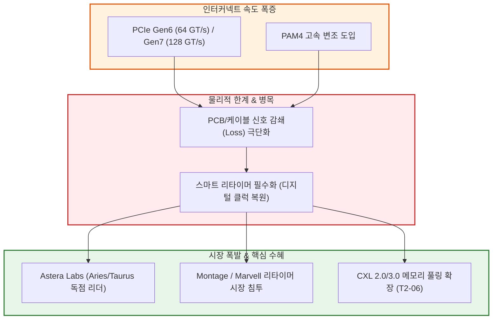

# T3-09 PCIe Gen6·Gen7 전환과 초고속 신호 리타이머 병목

> 🧭 **상위 인덱스**: [[00-Argus-Master-MOC|Master MOC]] ➔ [[00-Argus-Master-MOC#3-🌐-초고속-네트워킹--시스템-플랫폼-networking--systems|초고속 네트워킹 & 시스템 플랫폼]]

> 🏷️ **교차 분석 메타데이터**:
> - **레이어**: `L3` (인터커넥트 반도체 & 시스템 플랫폼)
> - **가설 성격**: `🚀 consensus (주류 성장)` — 신호 무결성(Signal Integrity) 병목 해소를 위한 필수 고마진 칩셋
> - **투자 방향**: `bullish` (Astera Labs 등 리타이머 선도 기업 수혜)

---

## 📌 가설 요약 (Executive Summary)
1. **신호 감쇄의 물리적 한계와 PAM4 변조 도입**:
   - PCIe Gen5(32 GT/s NRZ)에서 **PCIe Gen6(64 GT/s PAM4)** 및 **Gen7(128 GT/s)**로 전환되면서 주파수 대역폭이 2배씩 폭증함에 따라, PCB 기판과 커넥터를 통과할 때의 신호 감쇄(Insertion Loss)가 극단적으로 심화되었습니다.
2. **단순 리드라이버(Redriver)에서 스마트 리타이머(Retimer)로의 전면 전환**:
   - 단순 신호 증폭만 수행하는 리드라이버로는 노이즈까지 증폭되어 PAM4 신호 복원이 불가능합니다. 신호를 완전히 디지털로 복원(Re-timing)하고 프로토콜을 인식하는 **스마트 리타이머(Astera Labs Aries 시리즈 등)**가 전면 필수화되었습니다.
3. **AI 가속기 랙당 리타이머 탑재량 폭증**:
   - 엔비디아 HGX/MGX, GB200 서버 및 커스텀 ASIC 서버 1대당 GPU-CPU, GPU-NIC, CXL 메모리 풀 간의 통신 경로마다 8개~32개의 리타이머가 필수 탑재되며 소요량이 폭발하고 있습니다.
4. **소프트웨어와 융합된 고마진 칩렛 독점 생태계**:
   - Astera Labs의 COSMOS 소프트웨어 플랫폼과 같이 실시간 신호 상태 모니터링 및 진단 기능을 결합한 솔루션이 70% 이상의 높은 매출총이익률(Gross Margin)을 누리고 있습니다.

---

## 🕸️ 인과관계 다이어그램 (Mermaid Graph)



---

## 🔗 테제 간 연관관계 (Thesis Mapping)

- 🔼 **선행 하드웨어 기판 가설**:
  - [[T3-06-초고다층-기판-MLB와-초저손실-CCL-병목|T3-06 초고다층 기판 MLB와 초저손실 CCL 병목]] — 리타이머와 함께 신호 손실을 줄이는 고다층 PCB 인프라
- ➡️ **동반 및 상호 보완 가설**:
  - [[T3-04-800G·1.6T-광트랜시버와-AEC·LPO-초고속-인터커넥트-혁신|T3-04 800G·1.6T 광트랜시버와 AEC 인터커넥트]] — 케이블 끝단 및 메인보드 상의 신호 복원
  - [[T2-06-CXL-메모리의-확대|T2-06 CXL 메모리의 확대]] — CXL 스위치 및 메모리 확장 장치 간 리타이머 연결
  - [[T2-08-빅테크-커스텀-ASIC-증가와-DSP-생태계|T2-08 빅테크 커스텀 ASIC 증가]] — 빅테크 자체 칩 연결용 PCIe 리타이머 채택
- 🔽 **랙스케일 통합 가설**:
  - [[T3-10-NVLink-Switch-랙스케일-패브릭과-대규모-구리-백플레인|T3-10 NVLink Switch 랙스케일 패브릭]] — 랙 단위 고속 인터커넥트 생태계의 완성

---

## 🏢 연관 기업 & 핵심 기술 허브
- **PCIe/CXL 리타이머 1위**: [[Company-Astera Labs|Astera Labs (ALAB)]]
- **인터커넥트 반도체 경쟁사**: [[Company-Marvell|Marvell]], [[Company-Montage|Montage Technology (란치과기)]], [[Company-Broadcom|Broadcom]]
- **핵심 플랫폼**: [[Company-NVIDIA|NVIDIA]], [[Company-Intel|Intel]], [[Company-AMD|AMD]]

---

## 📈 지지 근거 (Bullish Arguments)
1. **PCIe Gen6 본격 채택**:
   - 2025~2026년 차세대 서버 CPU(Intel Xeon 6, AMD EPYC Turin) 및 가속기에서 PCIe Gen6 표준 채택이 본격화되며 리타이머 탑재율이 90% 이상으로 급증.
2. **Astera Labs의 독점적 시장 점유율**:
   - Tier-1 하이퍼스케일러 및 엔비디아 서버 공급망에서 80% 이상의 점유율을 기록하며 매출 성장률 100%+ 유지.
3. **CXL 메모리 풀링과의 결합**:
   - CXL 메모리 확장 장치(E3.S / CMM) 연결 시 지연시간 없는 리타이머 필수 탑재.

---

## 📉 반박 근거 및 위험 요인 (Bearish Risks)
1. **빅테크 자체 SerDes/리타이머 내재화 시도**:
   - 브로드컴, 엔비디아가 자체 스위치/GPU ASIC 내부에 초고성능 SerDes를 직접 통합하여 외장 리타이머 의존도를 낮출 위험.
2. **후발주자(중국계 Montage, 대만 Realtek 등)의 저가 공세**:
   - 범용 서버 시장에서의 가격 인하 압박.

---

## 📑 관련 산출물 (자동 집계)

### 🤖 Dataview 실시간 역방향 링크
```dataview
TABLE file.mtime AS "작성일", angle AS "관점", tags AS "태그"
FROM "argus" OR "output" OR ""
WHERE contains(thesis, "T3-09") OR contains(file.outlinks, this.file.link)
SORT file.mtime DESC
LIMIT 7
```
