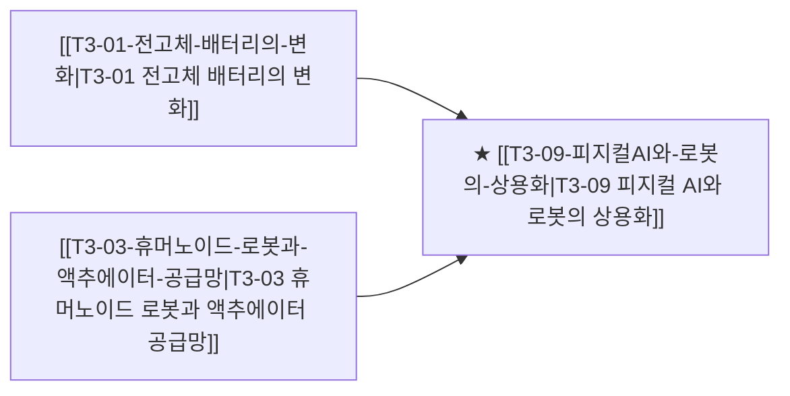

# T3-09 피지컬 AI와 로봇의 상용화

> 🧭 **상위 인덱스**: [[00-Argus-Master-MOC|Master MOC]] ➔ [[00-Argus-Master-MOC#3-🤖-피지컬-ai-로보틱스--엣지-디바이스-physical-ai--edge|피지컬 AI & 엣지 디바이스]]

> 🏷️ **교차 분석 메타데이터**:
> - **성격**: `🚀 주류 성장 (Consensus)` | **스택**: `L5 (디바이스)` | **시계**: `2026~2028`
> - **공급망 권역**: `KR`, `US` | **핵심 대결 구도**: 해당 없음

---

## 🎯 핵심 가설
AI가 데이터센터를 벗어나 물리 세계로 나오는 원년이 2026년이며, 휴머노이드 로봇의 공장·물류 실배치가 온디바이스 AI·배터리·센서 수요를 구조적으로 끌어올린다

---

## 🔗 테제 네트워크 (상호 연관 가설)



- 🔼 **선행 가설 (배경 요인 & 상위 인프라)**:
  - [[T3-01-전고체-배터리의-변화|T3-01 전고체 배터리의 변화]] — 차세대 로봇 배터리
  - [[T3-03-휴머노이드-로봇과-액추에이터-공급망|T3-03 휴머노이드 로봇과 액추에이터 공급망]] — 액추에이터·하드웨어 공급망
- ➡️ **동반 및 대체·경쟁 가설**:
  - (해당 없음)
- 🔽 **파생 및 후행 병목 가설**:
  - (해당 없음)

---

## 🏢 연관 기업 & 핵심 기술 허브
- **핵심 기업**: [[Company-Tesla|Tesla]], [[Company-현대차|현대차]], [[Company-레인보우로보틱스|레인보우로보틱스]], [[Company-HD현대|HD현대]], [[Company-Figure|Figure]]
- **핵심 기술/토픽**: [[Topic-피지컬AI|피지컬AI]]

---

## 📈 지지 근거
<!-- 시스템이 자동으로 채워주거나 사용자가 직접 메모 -->

---

## 📉 반박 근거
- 2026-09-05: 모건스탠리 모멘텀 TMT 지수 한 달간 53.5% 급락 등 AI 설비 롱/소프트웨어 숏 포지션의 동시 손실 발생과 AI capex가 견조한 수요가 아닌 경쟁 탈락 압박에 기인한다는 지적, 아마존 고정단가 계약으로 인한 원가 전가 불가 리스크가 부각됨
- 2026-09-04: 모건스탠리 모멘텀 TMT 지수가 한 달에 53.5% 급락하고 AI CAPEX가 수요 강세가 아닌 경쟁 압박 때문이며 아마존 등 고정단가 계약으로 원가 전가가 불가하다는 지적
- 2026-09-04: 모건스탠리 모멘텀 TMT 지수 한 달 53.5% 급락으로 AI 설비 롱·소프트웨어 숏 동시 손실 및 레버리지 청산 리스크가 부각되고 대규모 AI 투자가 견조한 수요가 아닌 경쟁 과열 신호라는 지적이 제기됨
- 2026-09-04: 모건스탠리 모멘텀 TMT 지수 한 달 53.5% 급락으로 AI 설비 롱 포지션 손실 및 AI 투자가 견조한 수요가 아닌 경쟁 압박에 의한 것이란 지적이 제기됨
<!-- 가설에 반하는 뉴스/데이터 -->

---

## 📑 관련 산출물 (자동 집계)

### 🤖 Dataview 실시간 역방향 링크
```dataview
TABLE file.mtime AS "작성일", angle AS "관점", tags AS "태그"
FROM "argus" OR "output" OR ""
WHERE contains(thesis, "T2-09") OR contains(thesis, "T2-09") OR contains(file.outlinks, this.file.link)
SORT file.mtime DESC
LIMIT 7
```

### 📌 수동 링크 아카이브
<!-- [[블로그 파일명]] 형식으로 링크 -->

---

## 📝 분석가 메모
- T-03(전고체 배터리)의 최초 양산 시장이 로봇용일 수 있음
- T-04(온디바이스 AI)의 핵심 수요처로 로봇 연결
