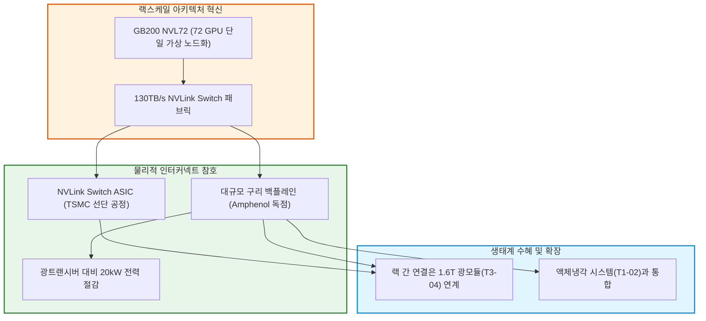

# T3-10 NVLink Switch 랙스케일 패브릭과 대규모 구리 백플레인

> 🧭 **상위 인덱스**: [[00-Argus-Master-MOC|Master MOC]] ➔ [[00-Argus-Master-MOC#3-🌐-초고속-네트워킹--시스템-플랫폼-networking--systems|초고속 네트워킹 & 시스템 플랫폼]]

> 🏷️ **교차 분석 메타데이터**:
> - **레이어**: `L3` (랙스케일 통신 패브릭 & 물리적 인터커넥트)
> - **가설 성격**: `🚀 consensus (주류 성장)` — NVL72 랙 단위 단일 가상 GPU를 구현하는 물리적 하드웨어 참호
> - **투자 방향**: `bullish` (NVIDIA, Amphenol 등 NVLink 스위치 및 구리 케이블링 독점 수혜)

---

## 📌 가설 요약 (Executive Summary)
1. **서버 노드 단위를 넘어선 '랙스케일(Rack-Scale)' 컴퓨팅의 표준화**:
   - 조(Trillion) 단위 파운데이션 모델의 훈련 및 대규모 병렬 추론을 위해, 엔비디아는 8개 GPU 연결(HGX)을 넘어 **72개 GPU를 총 130TB/s 대역폭의 단일 NVLink 도메인으로 묶는 GB200 NVL72 시스템**을 출시하며 패러다임을 전환했습니다.
2. **광통신 대비 20kW 전력을 절감하는 '구리 백플레인(Copper Cartridge)' 혁신**:
   - 랙 내부의 모든 연결을 광트랜시버로 처리할 경우 발생하는 막대한 전력(20kW+)과 발열을 피하기 위해, 엔비디아는 **5,000가닥 이상의 초정밀 구리선(OverPass 케이블)과 카트리지 백플레인(Amphenol 독점 제조)**을 통해 무(無)전력 패시브 초고속 연결을 완성했습니다.
3. **독점적 스위치 ASIC(NVLink Switch Chip) 생태계**:
   - TSMC 선단 공정에서 생산되는 전용 NVLink Switch 칩이 랙당 9개(18개 트레이) 탑재되어, 모든 GPU 간 논블로킹(Non-blocking) 풀메시 통신을 가능케 합니다.
4. **대규모 수주와 커넥터/케이블링 밸류에이션 리레이팅**:
   - 랙당 커넥터 및 케이블링 시스템 가격(BOM)이 기존 수백 달러에서 수천 달러로 10배 이상 폭증하며, Amphenol 등 핵심 공급사의 강력한 실적 성장을 견인하고 있습니다.

---

## 🕸️ 인과관계 다이어그램 (Mermaid Graph)



---

## 🔗 테제 간 연관관계 (Thesis Mapping)

- 🔼 **선행 인프라 및 냉각 가설**:
  - [[T1-02-데이터센터-액체냉각의-표준화|T1-02 데이터센터 액체냉각의 표준화]] — 120kW 초고밀도 NVL72 랙을 구동하기 위한 직접액체냉각(DLC) 필수 결합
- ➡️ **동반 및 상호 보완 가설**:
  - [[T3-04-800G·1.6T-광트랜시버와-AEC·LPO-초고속-인터커넥트-혁신|T3-04 800G·1.6T 광트랜시버]] — 랙 내부는 구리 백플레인, 랙 간 스케일아웃은 1.6T 광트랜시버로 이원화
  - [[T3-06-초고다층-기판-MLB와-초저손실-CCL-병목|T3-06 초고다층 기판 MLB와 초저손실 CCL 병목]] — NVLink 스위치 트레이용 초고다층 기판
  - [[T3-09-PCIe-Gen6·Gen7-전환과-초고속-신호-리타이머-병목|T3-09 PCIe Gen6/7 리타이머]] — PCIe/CXL 신호 무결성 보정
- 🔽 **컴퓨트 및 칩 생태계 가설**:
  - [[T2-08-빅테크-커스텀-ASIC-증가와-DSP-생태계|T2-08 빅테크 커스텀 ASIC]] — 빅테크의 NVLink 대항 독자 랙스케일 패브릭 구축 시도

---

## 🏢 연관 기업 & 핵심 기술 허브
- **랙스케일 아키텍처 주도**: [[Company-NVIDIA|NVIDIA]]
- **구리 백플레인 & 고속 커넥터 독점**: [[Company-Amphenol|Amphenol (APH)]]
- **서버 조립 및 랙 통합(ODM)**: Foxconn, Quanta, Wistron
- **핵심 기술/토픽**: [[Topic-초고속네트워킹|초고속네트워킹]], [[Topic-액체냉각|액체냉각]]

---

## 📈 지지 근거 (Bullish Arguments)
1. **하이퍼스케일러의 NVL72 대규모 발주**:
   - 마이크로소프트, AWS, OCI(오라클), 구글 등 주요 클라우드가 수만 랙 단위의 GB200 NVL72 사전 주문 완료.
2. **구리선 백플레인의 기술적 진입장벽**:
   - 2마일(약 3.2km) 길이의 수천 가닥 구리선을 오차 없이 카트리지 형태로 패키징하고 불량률을 0으로 유지하는 제조 역량은 Amphenol 등 극소수 기업만 가능.
3. **NVLink 독점 참호**:
   - 일반 이더넷 대비 2배 이상의 대역폭과 1/5 미만의 지연시간을 제공하여 경쟁사(AMD, 빅테크 자체 칩)의 진입을 원천 차단.

---

## 📉 반박 근거 및 위험 요인 (Bearish Risks)
1. **차세대(Rubin NVL576 등)에서 구리선의 물리적 한계 도달**:
   - 랙 스케일이 수백 개 GPU 이상으로 확장되거나 거리가 3m를 초과할 경우 결국 CPO 또는 광 인터커넥트로의 전환 불가피.
2. **단일 벤더(NVIDIA) 락인에 대한 빅테크의 견제**:
   - UALink(Ultra Accelerator Link) 등 오픈 표준 연합의 랙스케일 패브릭 대항마 개발.

---

## 📑 관련 산출물 (자동 집계)

### 🤖 Dataview 실시간 역방향 링크
```dataview
TABLE file.mtime AS "작성일", angle AS "관점", tags AS "태그"
FROM "argus" OR "output" OR ""
WHERE contains(thesis, "T3-10") OR contains(file.outlinks, this.file.link)
SORT file.mtime DESC
LIMIT 7
```
