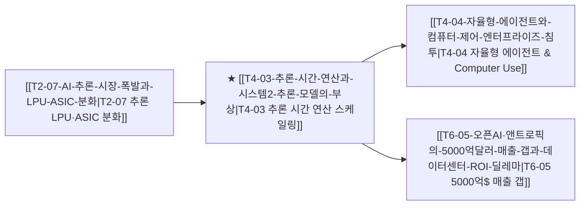

# T4-03 추론 시간 연산과 시스템 2 추론 모델의 부상

> 🧭 **상위 인덱스**: [[00-Argus-Master-MOC|Master MOC]] ➔ [[00-Argus-Master-MOC#4-💻-ai-엔터프라이즈-sw--파운데이션-모델-software--models|파운데이션 모델 & 엔터프라이즈 SW]]

> 🏷️ **교차 분석 메타데이터**:
> - **성격**: `🚀 주류 성장 (Consensus)` | **스택**: `L4 (파운데이션 모델/SW)` | **시계**: `2025~2027`
> - **공급망 권역**: `US` | **핵심 토픽**: [[Topic-프론티어모델|프론티어모델]]

---

## 🎯 핵심 가설
사전학습 데이터 한계(Data Wall)에 직면한 프론티어 AI(OpenAI o1·Anthropic)가 생각의 연쇄(CoT)와 추론 시간 연산(Test-Time Scaling)을 통해 성능을 비약적으로 확장하며, 질의당 토큰 소모량과 고성능 추론 컴퓨트 수요를 기하급수적으로 폭증시킨다.

---

## 🔗 테제 네트워크 (상호 연관 가설)



- 🔼 **선행 가설 (배경 요인 & 상위 인프라)**:
  - [[T2-07-AI-추론-시장-폭발과-LPU-ASIC-분화|T2-07 AI 추론 시장 폭발과 LPU·ASIC 분화]] — 저지연·고효율 추론 인프라 기반 마련
- ➡️ **동반 및 대체·경쟁 가설**:
  - [[T4-02-AI-소프트웨어-레이어의-과점화|T4-02 AI 소프트웨어 레이어의 과점화]] — 프론티어 모델의 B2B SW 레이어 수직 통합
- 🔽 **파생 및 후행 병목 가설**:
  - [[T4-04-자율형-에이전트와-컴퓨터-제어-엔터프라이즈-침투|T4-04 자율형 에이전트와 컴퓨터 제어의 침투]] — 심층 사고 기반의 다단계 에이전트 실행
  - [[T6-05-오픈AI·앤트로픽의-5000억달러-매출-갭과-데이터센터-ROI-딜레마|T6-05 5000억$ 매출 갭과 ROI 딜레마]] — 고가 추론 토큰 과금 모델의 시장 수용성 검증

---

## 🏢 연관 기업 & 핵심 기술 허브
- **핵심 기업**: [[Company-OpenAI|OpenAI]], [[Company-Anthropic|Anthropic]], [[Company-Microsoft|Microsoft]], [[Company-Alphabet|Alphabet]], [[Company-Amazon|Amazon]]
- **핵심 기술/토픽**: [[Topic-프론티어모델|프론티어모델]], [[Topic-ASIC|ASIC]]

---

## 📈 지지 근거
- OpenAI의 o1/o3 모델 공개를 기점으로 프론티어 모델의 경쟁 축이 사전학습(Pre-training)에서 사후학습(Post-training RL) 및 추론 시간 연산(Inference-time search)으로 완전히 이동함.
- 단위 문제 해결 시 모델 내부에서 소모되는 '사고 토큰(Thinking Tokens)'이 10배~100배 증가하여 추론 인프라의 CAPEX 집중도가 급상승함.

---

## 📉 반박 근거
- 고비용 추론 모델의 실시간 레이턴시(지연 시간) 및 고단가 API 비용으로 인해 단순 비즈니스 워크플로우에서의 ROI 확보가 지연될 가능성.

---

## 📑 관련 산출물 (자동 집계)

### 🤖 Dataview 실시간 역방향 링크
```dataview
TABLE file.mtime AS "작성일", angle AS "관점", tags AS "태그"
FROM "argus" OR "output" OR ""
WHERE contains(thesis, "T4-03") OR contains(file.outlinks, this.file.link)
SORT file.mtime DESC
LIMIT 7
```

### 📌 수동 링크 아카이브


---

## 📝 분석가 메모
프론티어 랩(OpenAI, Anthropic)의 핵심 승부처가 모델 크기 확장에서 '추론 시간 생각(Thinking/CoT)의 양'으로 이동하면서 AI 데이터센터의 전력과 칩 수요가 학습용에서 추론용으로 급격히 재배치되는 구조적 전환점입니다.
