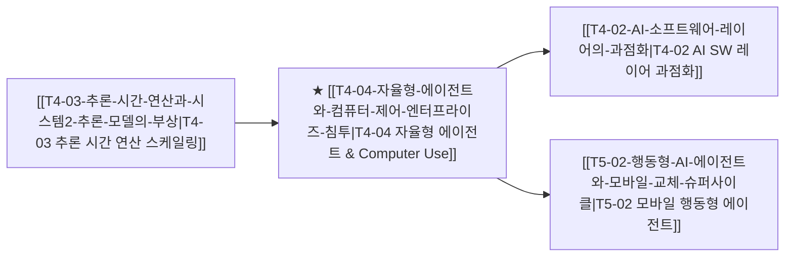

# T4-04 자율형 에이전트와 컴퓨터 제어의 엔터프라이즈 침투

> 🧭 **상위 인덱스**: [[00-Argus-Master-MOC|Master MOC]] ➔ [[00-Argus-Master-MOC#4-💻-ai-엔터프라이즈-sw--파운데이션-모델-software--models|파운데이션 모델 & 엔터프라이즈 SW]]

> 🏷️ **교차 분석 메타데이터**:
> - **성격**: `🚀 주류 성장 (Consensus)` | **스택**: `L4 (파운데이션 모델/SW)` | **시계**: `2025~2027`
> - **공급망 권역**: `US` | **핵심 토픽**: [[Topic-AI에이전트|AI에이전트]]

---

## 🎯 핵심 가설
Anthropic의 Computer Use와 OpenAI의 Operator 등 자율형 에이전트가 화면(GUI) 인식 및 직접 제어 능력을 확보함에 따라, 레거시 RPA와 단순 챗봇을 파괴적으로 대체하고 차세대 기업용 업무 자동화 OS로 군림한다.

---

## 🔗 테제 네트워크 (상호 연관 가설)



- 🔼 **선행 가설 (배경 요인 & 상위 인프라)**:
  - [[T4-03-추론-시간-연산과-시스템2-추론-모델의-부상|T4-03 추론 시간 연산과 시스템 2 추론 모델의 부상]] — 복합 다단계 계획 수립 능력 제공
- ➡️ **동반 및 대체·경쟁 가설**:
  - [[T4-02-AI-소프트웨어-레이어의-과점화|T4-02 AI 소프트웨어 레이어의 과점화]] — 기존 SaaS 벤더와 프론티어 에이전트 플랫폼 간의 과점화 경쟁
- 🔽 **파생 및 후행 병목 가설**:
  - [[T5-02-행동형-AI-에이전트와-모바일-교체-슈퍼사이클|T5-02 행동형 AI 에이전트와 모바일 교체]] — PC GUI 에이전트에서 모바일 디바이스 제어로 확장

---

## 🏢 연관 기업 & 핵심 기술 허브
- **핵심 기업**: [[Company-Anthropic|Anthropic]], [[Company-OpenAI|OpenAI]], [[Company-Microsoft|Microsoft]], [[Company-Salesforce|Salesforce]], [[Company-ServiceNow|ServiceNow]]
- **핵심 기술/토픽**: [[Topic-AI에이전트|AI에이전트]], [[Topic-프론티어모델|프론티어모델]]

---

## 📈 지지 근거
- Anthropic Claude 3.5 Sonnet의 'Computer Use API' 발표로 브라우저, 스프레드시트, ERP 시스템 간 데이터 이동 및 자동 입력 작업이 API 연동 없이 스크린 제어로 완결됨.
- OpenAI 역시 브라우저를 직접 조작하는 자율 에이전트(Operator) 프로젝트를 본격화하며 B2B 업무 프로세스 자동화 시장 진입 가속.

---

## 📉 반박 근거
- 기업 보안 정책(인간 개입 없는 민감 시스템 제어에 대한 거부감) 및 부정확한 클릭/입력으로 인한 법적·운영 리스크.

---

## 📑 관련 산출물 (자동 집계)

### 🤖 Dataview 실시간 역방향 링크
```dataview
TABLE file.mtime AS "작성일", angle AS "관점", tags AS "태그"
FROM "argus" OR "output" OR ""
WHERE contains(thesis, "T4-04") OR contains(file.outlinks, this.file.link)
SORT file.mtime DESC
LIMIT 7
```

### 📌 수동 링크 아카이브


---

## 📝 분석가 메모
'Computer Use'는 API가 없는 수많은 레거시 엔터프라이즈 소프트웨어를 AI가 사람처럼 다룰 수 있게 만드는 전환점이며, 이는 기존 UIPath 등 전통 RPA 소프트웨어의 가치사슬을 완전히 붕괴시키고 프론티어 AI 랩으로 권력을 집중시킵니다.
