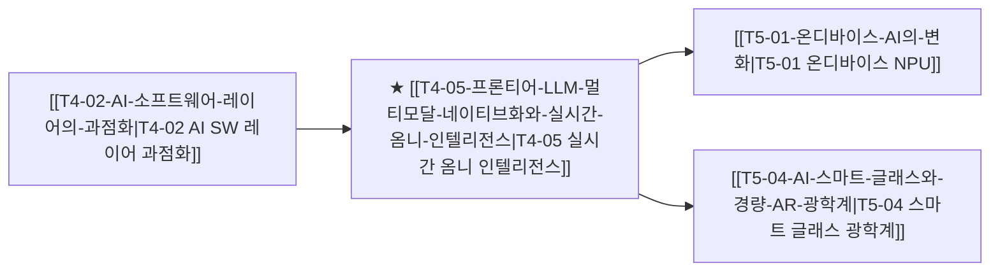

# T4-05 프론티어 LLM 멀티모달 네이티브화와 실시간 옴니 인텔리전스

> 🧭 **상위 인덱스**: [[00-Argus-Master-MOC|Master MOC]] ➔ [[00-Argus-Master-MOC#4-💻-ai-엔터프라이즈-sw--파운데이션-모델-software--models|파운데이션 모델 & 엔터프라이즈 SW]]

> 🏷️ **교차 분석 메타데이터**:
> - **성격**: `🚀 주류 성장 (Consensus)` | **스택**: `L4 (파운데이션 모델/SW)` | **시계**: `2025~2027`
> - **공급망 권역**: `US` | **핵심 토픽**: [[Topic-프론티어모델|프론티어모델]]

---

## 🎯 핵심 가설
텍스트·음성·비전이 별도의 변환(STT/TTS) 없이 단일 신경망에서 엔드투엔드로 통합 처리되는 '옴니(Omni) 네이티브 모델'이 실시간 음성 상호작용의 표준이 되며, 글로벌 컨택센터 및 실시간 AI 비서 시장을 전면 재편한다.

---

## 🔗 테제 네트워크 (상호 연관 가설)



- 🔼 **선행 가설 (배경 요인 & 상위 인프라)**:
  - [[T4-02-AI-소프트웨어-레이어의-과점화|T4-02 AI 소프트웨어 레이어의 과점화]] — 빅테크 파운데이션 모델 생태계 락인
- ➡️ **동반 및 대체·경쟁 가설**:
  - [[T4-01-오픈소스-모델-고도화와-온프레미스-사설-AI|T4-01 오픈소스 모델 고도화와 온프레미스]] — 경량 멀티모달 오픈소스(Llama Vision 등)와 상용 옴니 모델 간 격차
- 🔽 **파생 및 후행 병목 가설**:
  - [[T5-01-온디바이스-AI의-변화|T5-01 온디바이스 AI의 변화]] — 디바이스 온보드 옴니 모델 경량화
  - [[T5-04-AI-스마트-글래스와-경량-AR-광학계|T5-04 AI 스마트 글래스와 경량 AR 광학계]] — 실시간 카메라 시각 인식을 결합한 인터페이스

---

## 🏢 연관 기업 & 핵심 기술 허브
- **핵심 기업**: [[Company-OpenAI|OpenAI]], [[Company-Anthropic|Anthropic]], [[Company-Microsoft|Microsoft]], [[Company-Alphabet|Alphabet]], [[Company-Apple|Apple]]
- **핵심 기술/토픽**: [[Topic-프론티어모델|프론티어모델]], [[Topic-온디바이스AI|온디바이스AI]]

---

## 📈 지지 근거
- OpenAI의 GPT-4o(Omni) Advanced Voice Mode와 Anthropic Claude의 멀티모달 비전 역량 강화로 음성 지연 시간이 인간 반응 속도(200~300ms) 수준으로 단축됨.
- 억양, 감정, 배경 소음 인식 및 실시간 끼어들기(Barge-in)가 네이티브로 가능해져 기존 STT ➔ LLM ➔ TTS의 3단계 파이프라인 대비 인터랙션 품질이 비약적으로 향상됨.

---

## 📉 반박 근거
- 실시간 오디오/비디오 스트리밍 처리에 따른 토큰 대역폭 및 추론 서버 컴퓨트 비용 부담.

---

## 📑 관련 산출물 (자동 집계)

### 🤖 Dataview 실시간 역방향 링크
```dataview
TABLE file.mtime AS "작성일", angle AS "관점", tags AS "태그"
FROM "argus" OR "output" OR ""
WHERE contains(thesis, "T4-05") OR contains(file.outlinks, this.file.link)
SORT file.mtime DESC
LIMIT 7
```

### 📌 수동 링크 아카이브


---

## 📝 분석가 메모
'옴니(Omni)' 모델은 인간과의 상호작용 인터페이스를 텍스트 프롬프트 창에서 실시간 음성과 시각 화면으로 완전히 이동시키는 핵심 동인이며, 스마트폰 및 스마트 글래스 디바이스와의 결합을 촉진합니다.
