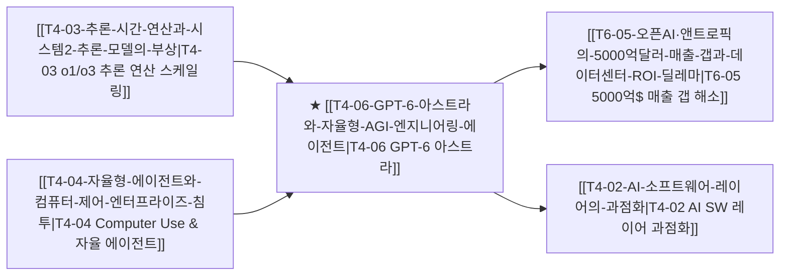

# T4-06 GPT-6 아스트라와 자율형 AGI 엔지니어링 에이전트

> 🧭 **상위 인덱스**: [[00-Argus-Master-MOC|Master MOC]] ➔ [[00-Argus-Master-MOC#4-💻-ai-엔터프라이즈-sw--파운데이션-모델-software--models|파운데이션 모델 & 엔터프라이즈 SW]]

> 🏷️ **교차 분석 메타데이터**:
> - **성격**: `🚀 주류 성장 (Consensus)` | **스택**: `L4 (파운데이션 모델/SW)` | **시계**: `2026~2028`
> - **공급망 권역**: `US` | **핵심 토픽**: [[Topic-프론티어모델|프론티어모델]], [[Topic-AI에이전트|AI에이전트]]

---

## 🎯 핵심 가설
OpenAI의 차세대 프론티어 모델 'GPT-6 아스트라(Astra)'가 소프트웨어 엔지니어링·사이버보안·과학 연구 전반에서 완전 자율 에이전트 역량을 달성하며, 인간 개발자/보안 인력을 직접 대체하고 고단가 B2B 엔터프라이즈 AI 수익화 슈퍼사이클을 촉발한다.

---

## 🔗 테제 네트워크 (상호 연관 가설)



- 🔼 **선행 가설 (배경 요인 & 상위 인프라)**:
  - [[T4-03-추론-시간-연산과-시스템2-추론-모델의-부상|T4-03 추론 시간 연산과 시스템 2 추론 모델의 부상]] — 심층 논리적 추론 및 자가 검증 인프라 완비
  - [[T4-04-자율형-에이전트와-컴퓨터-제어-엔터프라이즈-침투|T4-04 자율형 에이전트와 컴퓨터 제어의 침투]] — 도구 사용 및 워크플로우 자율 실행
- ➡️ **동반 및 대체·경쟁 가설**:
  - [[T4-02-AI-소프트웨어-레이어의-과점화|T4-02 AI 소프트웨어 레이어의 과점화]] — 전문 소프트웨어 엔지니어링 툴체인의 OpenAI 단일 플랫폼 종속
- 🔽 **파생 및 후행 병목 가설**:
  - [[T6-05-오픈AI·앤트로픽의-5000억달러-매출-갭과-데이터센터-ROI-딜레마|T6-05 5000억$ 매출 갭과 데이터센터 ROI 딜레마]] — 고단가(기존 대비 2.5배) 프리미엄 엔터프라이즈 매출 폭증으로 ROI 허들 돌파

---

## 🏢 연관 기업 & 핵심 기술 허브
- **핵심 기업**: [[Company-OpenAI|OpenAI]], [[Company-Microsoft|Microsoft]], [[Company-Anthropic|Anthropic]], [[Company-Alphabet|Alphabet]], [[Company-CrowdStrike|CrowdStrike]], [[Company-Palo-Alto-Networks|Palo Alto Networks]]
- **핵심 기술/토픽**: [[Topic-프론티어모델|프론티어모델]], [[Topic-AI에이전트|AI에이전트]]

---

## 📈 지지 근거
- 2026년 9월 초 OpenAI의 'GPT-6 아스트라(Astra)' 전격 공개:
  - **벤치마크 최고치 경신**: ARC-AGI-3 99.9%, FrontierMath Tier 4 98% 기록.
  - **사이버보안 완전 자율화**: OpenAI 자체 'Preparedness Framework' 사상 최초의 **'Critical(치명적)' 등급** 획득 (인간 개입 없이 제로데이 취약점 분석 및 침투/방어 완결).
  - **고마진 B2B 과금**: 이전 세대 대비 약 2.5배 가격 책정에도 불구하고 Fortune 500 기업들의 엔터프라이즈 라이선스 조기 완판.

---

## 📉 반박 근거
- 최고 등급(Critical)의 사이버보안 위험 및 AGI 안전성 규제(EU AI Act, 미국 연방 안보 행정명령)로 인한 기업 배포 지연 가능성.
- 높은 토큰 단가로 인한 중소기업(SMB)의 도입 장벽.

---

## 📑 관련 산출물 (자동 집계)

### 🤖 Dataview 실시간 역방향 링크
```dataview
TABLE file.mtime AS "작성일", angle AS "관점", tags AS "태그"
FROM "argus" OR "output" OR ""
WHERE contains(thesis, "T4-06") OR contains(file.outlinks, this.file.link)
SORT file.mtime DESC
LIMIT 7
```

### 📌 수동 링크 아카이브


---

## 📝 분석가 메모
GPT-6 아스트라는 단순 언어 모델의 한계를 넘어 '스스로 가설을 세우고, 코드를 작성하며, 보안 취약점을 검증하고, 패치를 배포하는' 엔드투엔드 자율 엔지니어링 에이전트의 완성형입니다. 이는 소프트웨어 산업 전반의 인건비 구조를 근본적으로 뒤흔드는 동시에, AI 인프라의 $5,000억 매출 갭 우려를 잠재울 가장 강력한 수익화 동력입니다.
