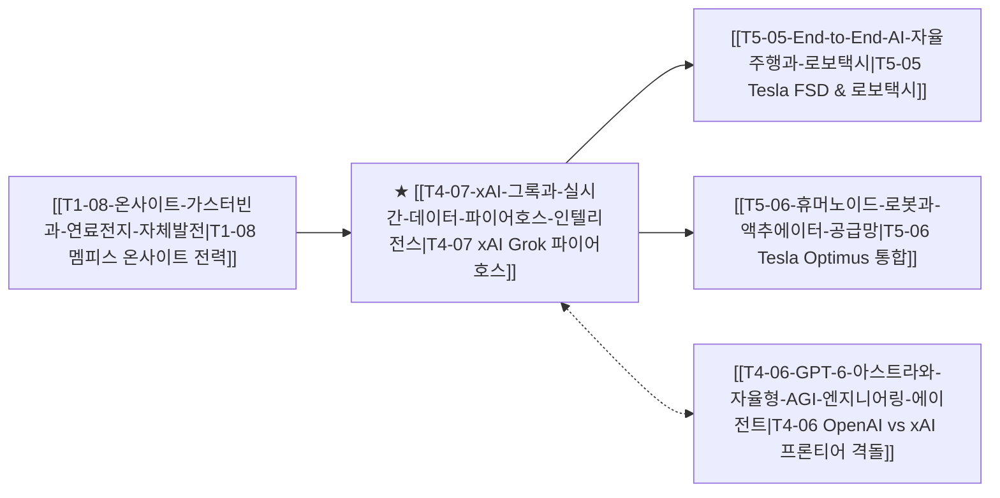

# T4-07 xAI 그록과 실시간 데이터 파이어호스 인텔리전스

> 🧭 **상위 인덱스**: [[00-Argus-Master-MOC|Master MOC]] ➔ [[00-Argus-Master-MOC#4-💻-ai-엔터프라이즈-sw--파운데이션-모델-software--models|파운데이션 모델 & 엔터프라이즈 SW]]

> 🏷️ **교차 분석 메타데이터**:
> - **성격**: `🚀 주류 성장 (Consensus)` | **스택**: `L4 (파운데이션 모델/SW)` | **시계**: `2025~2027`
> - **공급망 권역**: `US` | **핵심 토픽**: [[Topic-프론티어모델|프론티어모델]], [[Topic-AI에이전트|AI에이전트]]

---

## 🎯 핵심 가설
xAI가 X(구 트위터)의 독점적 글로벌 실시간 데이터 파이어호스와 멤피스 'Colossus(20만 GPU)' 슈퍼클러스터를 결합한 'Grok'을 통해 정적 웹 크롤링 기반 모델의 한계를 돌파하며, 실시간 검색·소버린 지능 및 머스크 피지컬 AI 생태계(Tesla FSD·Optimus)의 통합 두뇌로 부상한다.

---

## 🔗 테제 네트워크 (상호 연관 가설)



- 🔼 **선행 가설 (배경 요인 & 상위 인프라)**:
  - [[T1-08-온사이트-가스터빈과-연료전지-자체발전|T1-08 온사이트 가스터빈과 연료전지 자체발전]] — 멤피스 Colossus의 초고속 전력 공급 인프라 구축 (두산에너빌리티 가스터빈 결합)
- ➡️ **동반 및 대체·경쟁 가설**:
  - [[T4-06-GPT-6-아스트라와-자율형-AGI-엔지니어링-에이전트|T4-06 GPT-6 아스트라와 자율형 AGI]] — 폐쇄형 프론티어(OpenAI) vs 실시간 개방형(xAI Grok) 양강 구도
- 🔽 **파생 및 후행 병목 가설**:
  - [[T5-05-End-to-End-AI-자율주행과-로보택시|T5-05 End-to-End AI 자율주행과 로보택시]] — Grok의 시각-언어-행동(VLA) 추론 능력이 Tesla Cybercab 차량 관제에 이식
  - [[T5-06-휴머노이드-로봇과-액추에이터-공급망|T5-06 휴머노이드 로봇과 액추에이터]] — Optimus 휴머노이드의 일반 상식 추론 두뇌로 결합

---

## 🏢 연관 기업 & 핵심 기술 허브
- **핵심 기업**: [[Company-xAI|xAI]], [[Company-Tesla|Tesla]], [[Company-NVIDIA|NVIDIA]], [[Company-Supermicro|Supermicro]], [[Company-두산에너빌리티|두산에너빌리티]]
- **핵심 기술/토픽**: [[Topic-프론티어모델|프론티어모델]], [[Topic-AI에이전트|AI에이전트]]

---

## 📈 지지 근거
- **독점적 실시간 데이터 스트림**: 전 세계 5억 명 이상의 X 사용자가 생성하는 속보, 멀티미디어, 기술 토론 데이터를 0초 레이턴시로 흡수하여 정적 사전학습 모델의 할루시네이션 및 정보 시차를 극복.
- **초고속 컴퓨트 스케일링(Colossus)**: 멤피스에 122일 만에 10만 대의 H100 클러스터를 구축하고 20만 대로 확장 완료. 이동식 액체냉각과 가스터빈 발전기를 도입하여 기존 데이터센터 건설 기간을 3분의 1로 단축.
- **머스크 생태계 시너지**: Grok 3의 추론 엔진이 테슬라 FSD(자율주행), Optimus(로봇), 스페이스X 텔레메트리 관제와 결합되며 '디지털 AI + 피지컬 AI'의 수직 통합 구축.

---

## 📉 반박 근거
- X 플랫폼 내 편향되거나 검증되지 않은 소셜 데이터 학습으로 인한 모델 신뢰성/안전성 논란.
- 멤피스 클러스터의 전력 소비 및 환경 규제 리스크.

---

## 📑 관련 산출물 (자동 집계)

### 🤖 Dataview 실시간 역방향 링크
```dataview
TABLE file.mtime AS "작성일", angle AS "관점", tags AS "태그"
FROM "argus" OR "output" OR ""
WHERE contains(thesis, "T4-07") OR contains(file.outlinks, this.file.link)
SORT file.mtime DESC
LIMIT 7
```

### 📌 수동 링크 아카이브


---

## 📝 분석가 메모
xAI Grok은 단순한 챗봇이 아니라 일론 머스크의 3대 자산인 'X의 실시간 데이터 + 테슬라의 피지컬 로보틱스 + 멤피스 Colossus의 막강한 전력/연산 인프라'를 하나로 묶는 핵심 연결고리입니다. OpenAI와 구글이 갖추지 못한 소셜 실시간 데이터 파이어호스와 온사이트 인프라 기동력은 AI 패권 경쟁의 가장 강력한 비대칭 무기입니다.
