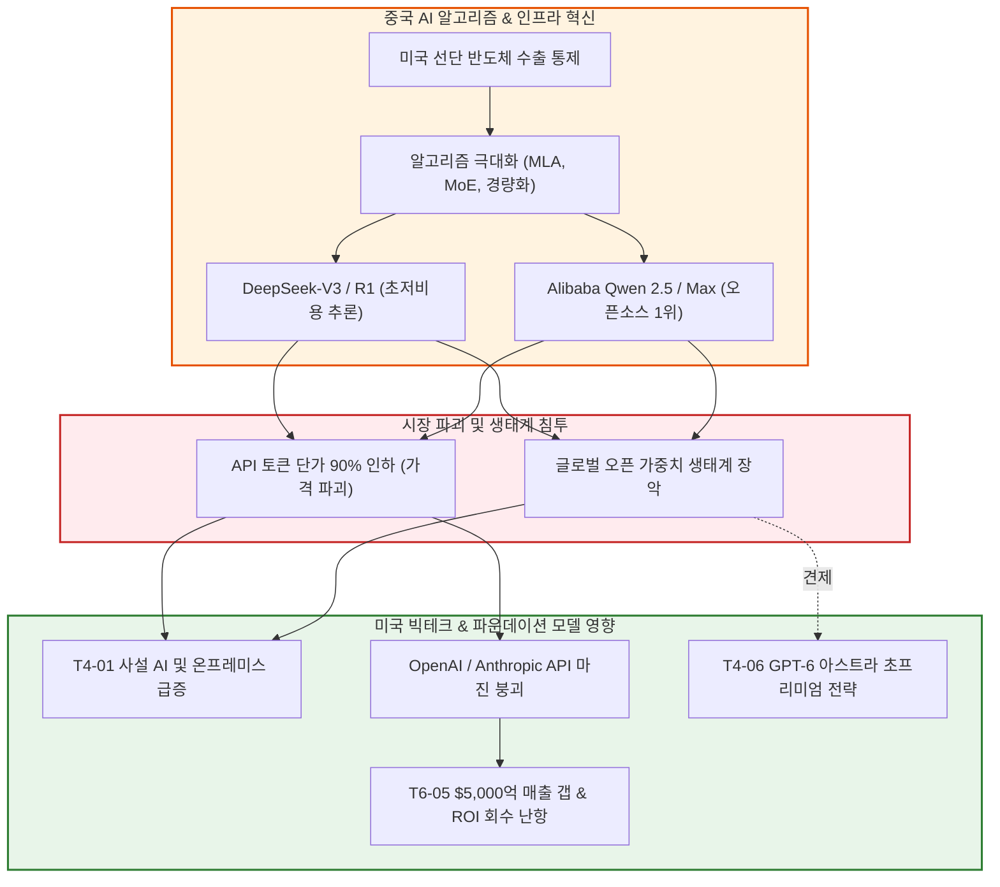

# T4-08 중국 AI 모델 급부상과 오픈AI·앤트로픽 과점 위협

> 🧭 **상위 인덱스**: [[00-Argus-Master-MOC|Master MOC]] ➔ [[00-Argus-Master-MOC#4-💻-ai-엔터프라이즈-sw--파운데이션-모델-software--models|파운데이션 모델 & 엔터프라이즈 SW]]

> 🏷️ **교차 분석 메타데이터**:
> - **레이어**: `L4` (파운데이션 모델 / 엔터프라이즈 SW)
> - **가설 성격**: `🛡️ contrarian (역발상 / 헷지)` — 미국 빅테크의 무한 독점 프리미엄에 대한 강력한 마진 붕괴 위협
> - **투자 방향**: `bearish` (폐쇄형 고마진 LLM API 사업자 마진 압박)

---

## 📌 가설 요약 (Executive Summary)
1. **중국 AI의 알고리즘 효율화 혁신**: 미국의 첨단 반도체(H100, B200 등) 수출 통제에 직면한 중국 AI 기업들(DeepSeek, Alibaba Cloud Qwen, Moonshot 등)은 **MLA(Multi-Head Latent Attention)** 및 **DeepSeekMoE**와 같은 획기적인 아키텍처 최적화를 통해 미국 모델 대비 1/5~1/10 수준의 연산량과 비용으로 GPT-4o / o1 및 Claude 3.5 Sonnet에 필적하는 성능을 달성했습니다.
2. **극단적인 토큰 가격 파괴 (Deflationary AI)**: DeepSeek-V3/R1 및 Qwen 2.5/Max는 백만 토큰당 입력 $0.14, 출력 $0.28 수준의 초저가 API를 제공하며, 이는 OpenAI/Anthropic의 기존 상용 API 대비 90% 이상 저렴한 수준입니다.
3. **오픈 가중치(Open Weights) 확산과 사설 AI 잠식**: 관대한 오픈소스 라이선스를 기반으로 글로벌 개발자 및 엔터프라이즈의 사설 AI(On-Premise / Private VPC) 구축 수요를 급속도로 흡수하여, 고비용 폐쇄형 API에 의존하던 미국 빅테크의 '잠금(Lock-in)' 효과를 해체하고 있습니다.
4. **미국 빅테크의 CAPEX ROI 회수 딜레마 가중**: 프론티어 LLM의 지능이 빠르게 커모디티화(Commoditization)됨에 따라, OpenAI와 Anthropic의 고단가 B2B 수익화 전략([[T6-05-오픈AI·앤트로픽의-5000억달러-매출-갭과-데이터센터-ROI-딜레마|T6-05]])에 심각한 마진 압박(Margin Compression)을 유발하고 있습니다.

---

## 🕸️ 인과관계 다이어그램 (Mermaid Graph)



---

## 🔗 테제 간 연관관계 (Thesis Mapping)

```
                       [T6-06 소버린 AI & 국가 인프라]
                                     │
                                     ▼
 [T4-08 중국 AI 급부상과 오픈AI·앤트로픽 과점 위협] (L4)
        │                                  │
        ├──► [T4-01 오픈소스 & 사설 AI]   ├──► [T6-05 $5000억 매출 갭 & ROI 딜레마]
        └──► [T4-03 추론 시간 연산 (o1/R1)] └──► [T4-06 GPT-6 아스트라 프리미엄] (대항마)
```

- 🔼 **선행 가설 (배경 요인 & 글로벌 환경)**:
  - [[T6-06-소버린-AI와-국가-단위-컴퓨트-인프라|T6-06 소버린 AI와 국가 단위 컴퓨트 인프라]] — 중국 국가 주도 컴퓨팅 파크 및 자체 AI 생태계 육성
  - [[T6-07-중국반도체의-HBM-생산가능성|T6-07 중국 반도체의 HBM 생산 가능성]] — 하드웨어 공급망 내재화 노력
- ➡️ **동반 및 촉진 가설**:
  - [[T4-01-오픈소스-모델-고도화와-온프레미스-사설-AI|T4-01 오픈소스 모델 고도화와 온프레미스 사설 AI]] — DeepSeek와 Qwen이 Meta Llama와 함께 사설 AI 시장 양분
  - [[T4-03-추론-시간-연산과-시스템2-추론-모델의-부상|T4-03 추론 시간 연산과 시스템 2 추론 모델의 부상]] — DeepSeek-R1이 오픈소스 진영 최초로 OpenAI o1급 강화학습 추론 달성
- 🔽 **위협 및 파생 충격 가설**:
  - [[T6-05-오픈AI·앤트로픽의-5000억달러-매출-갭과-데이터센터-ROI-딜레마|T6-05 오픈AI·앤트로픽의 5000억$ 매출 갭과 ROI 딜레마]] — 토큰 단가 디플레이션으로 인한 고가 인프라 CAPEX 회수 지연
  - [[T4-06-GPT-6-아스트라와-자율형-AGI-엔지니어링-에이전트|T4-06 GPT-6 아스트라와 자율형 AGI 엔지니어링 에이전트]] — OpenAI가 초프리미엄 AGI 영역으로 도피해야 하는 원인 제공

---

## 🏢 연관 기업 & 핵심 기술 허브
- **공세 기업 (중국 진영)**: [[Company-DeepSeek|DeepSeek]], [[Company-Alibaba|Alibaba]], [[Company-Baidu|Baidu]], [[Company-화웨이|화웨이]]
- **방어 기업 (미국 진영)**: [[Company-OpenAI|OpenAI]], [[Company-Anthropic|Anthropic]], [[Company-Meta|Meta]], [[Company-Microsoft|Microsoft]]
- **핵심 기술/토픽**: [[Topic-프론티어모델|프론티어모델]], [[Topic-AI에이전트|AI에이전트]]

---

## 📈 지지 근거 (Bullish for Chinese Disruption)
1. **알고리즘 혁신을 통한 컴퓨트 병목 극복**:
   - DeepSeek-V3는 MLA(Multi-Head Latent Attention) 기술로 KV 캐시 압축률을 90% 이상 끌어올렸으며, 671B 파라미터(활성 37B) MoE 모델을 단 2,000여 개의 구형 H800 클러스터와 약 $600만(약 80억 원) 미만의 학습 비용으로 완결.
   - DeepSeek-R1은 순수 강화학습(RL) 기반 시스템 2 추론을 도입하여 미국 o1 모델 대비 압도적으로 적은 연산량으로 수학(MATH-500 97.3%) 및 코딩 벤치마크 석권.
2. **글로벌 엔터프라이즈의 비용 절감 압력**:
   - 대규모 텍스트 분석 및 코딩 에이전트를 운용하는 기업들이 OpenAI/Anthropic API의 과도한 비용 부담을 회피하고 DeepSeek/Qwen 자체 호스팅 또는 저가 클라우드 API로 전환 가속.
3. **오픈 가중치 기반 커뮤니티 장악**:
   - Hugging Face, GitHub 등 글로벌 개발자 커뮤니티에서 Qwen 및 DeepSeek 파생 미세조정(Fine-tuned) 모델들이 다운로드 상위권을 휩쓸며 사실상의 표준(De facto standard) 형성.

---

## 📉 반박 근거 및 한계 (Counterarguments & Defenses)
1. **최선단 AGI 영역에서의 지능 격차**:
   - OpenAI의 GPT-6 아스트라(ARC-AGI-3 99.9%, 자율 사이버보안 Critical 등급) 등 최선단 영역에서는 여전히 미국 빅테크의 방대한 컴퓨트(100k+ 최신 GPU)와 독점 데이터 기반 선도력 유지.
2. **지정학적 데이터 안보 및 백도어 규제 장벽**:
   - 미국 국방부, 정부 기관, 포춘 100대 금융/의료 기업은 보안 규정 및 국청(NDAA/CISA) 제재로 인해 중국계 오픈소스 모델 도입이 원천 금지됨.
3. **선단 하드웨어 스케일업 제한**:
   - 미국의 추가 제재(HBM3E 차단, CXMT 장비 수출 통제)로 인해 차세대 100조 파라미터급 초대형 AGI 모델의 파운데이션 사전학습(Pre-training) 규모 확장에는 물리적 한계 봉착.

---

## 📑 관련 산출물 (자동 집계)

### 🤖 Dataview 실시간 역방향 링크
```dataview
TABLE file.mtime AS "작성일", angle AS "관점", tags AS "태그"
FROM "argus" OR "output" OR ""
WHERE contains(thesis, "T4-08") OR contains(file.outlinks, this.file.link)
SORT file.mtime DESC
LIMIT 7
```

---

## 📝 분석가 메모
중국 AI 진영의 급부상은 단순한 '저가 카피'가 아닌 **'아키텍처 혁신을 통한 AI 연산 효율의 대전환'**입니다. 이는 미국 빅테크가 천문학적 CAPEX로 구축한 '컴퓨트 참호'의 가치를 일부 희석시키며, LLM API의 마진 붕괴를 촉발하고 있습니다. 
결과적으로 OpenAI와 Anthropic은 단순 텍스트/코딩 모델의 가격 방어를 포기하고, **GPT-6 아스트라와 같은 고난도 자율 AGI 엔지니어링 및 전용 에이전트 시장으로 빠르게 도피**할 수밖에 없는 구조적 압박을 받게 되었습니다.
