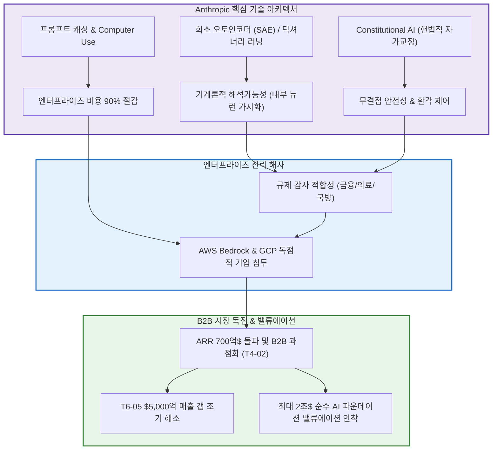

# T4-09 앤트로픽 클로드의 해석가능성 기술과 엔터프라이즈 AI 독점

> 🧭 **상위 인덱스**: [[00-Argus-Master-MOC|Master MOC]] ➔ [[00-Argus-Master-MOC#4-💻-ai-엔터프라이즈-sw--파운데이션-모델-software--models|파운데이션 모델 & 엔터프라이즈 SW]]

> 🏷️ **교차 분석 메타데이터**:
> - **레이어**: `L4` (파운데이션 모델 / 엔터프라이즈 SW)
> - **가설 성격**: `🚀 consensus (주류 성장)` — 기술적 안전성/해석가능성 해자를 통한 B2B 엔터프라이즈 독점
> - **투자 방향**: `bullish` (AWS/GCP 생태계 및 Anthropic 밸류에이션 급상승)

---

## 📌 가설 요약 (Executive Summary)
1. **기계론적 해석가능성(Mechanistic Interpretability)의 원천기술 독점**:
   - Anthropic은 **희소 오토인코더(SAE, Sparse Autoencoders)** 및 딕셔너리 러닝(Dictionary Learning)을 통해 거대 언어 모델 내부의 수백만 개 특징(Features)을 분해·추적하는 독보적 기술을 상용화했습니다.
   - 이를 통해 모델의 환각(Hallucination), 기만적 행동(Deception), 편향, 제로데이 보안 취약점 악용 뉴런을 사전에 식별하고 실시간 조작(Feature Steering / Clamping)할 수 있는 세계 유일의 **'내부 감사 가능한(Audit-ready) AI 아키텍처'**를 구축했습니다.
2. **Constitutional AI & RLCAI 기반의 무결점 정렬(Alignment)**:
   - 인간의 주관적 개입(RLHF) 대신 AI가 명문화된 원칙(헌법)에 따라 자가 교정하는 RLAIF 원천 기술을 적용하여, 금융·의료·사법 등 고위험 규제 산업에서 요구하는 법적 안전 기준을 완벽히 충족합니다.
3. **혁신적 엔터프라이즈 시스템 아키텍처**:
   - **프롬프트 캐싱(Prompt Caching)**: 컨텍스트 비용 90% 절감 및 응답 지연시간(Latency) 80% 단축.
   - **Computer Use & Artifacts**: Claude 3.5/3.7 Sonnet 기반의 OS 스크린 직접 제어와 인터랙티브 코드 실행 워크플로우를 선도.
4. **미션 크리티컬 B2B 시장 독점과 메가 밸류에이션 정당화**:
   - OpenAI나 오픈소스 모델(Llama, DeepSeek)이 제공하지 못하는 '설명 가능성(Explainability)'과 '보안 신뢰성'을 무기로 포춘 500대 기업의 엔터프라이즈 코어 파이프라인을 장악하며, AWS Bedrock 및 Google Cloud를 통해 폭발적인 ARR 성장과 사상 최대 규모의 기업가치를 정당화하고 있습니다.

---

## 🕸️ 인과관계 다이어그램 (Mermaid Graph)



---

## 🔗 테제 간 연관관계 (Thesis Mapping)

```
                       [T4-09 앤트로픽 해석가능성 & 엔터프라이즈 독점] (L4)
                                     │
        ┌────────────────────────────┼────────────────────────────┐
        ▼                            ▼                            ▼
 [T4-04 자율 에이전트/Computer Use] [T4-02 AI SW 레이어 과점화]  [T6-05 $5000억 매출 갭 해소]
        ▲                            ▲                            ▲
        │                            │                            │
 [T4-03 o1/o3 추론 연산]      [T4-08 중국 AI 저가 공세 방어]     [T4-06 GPT-6 아스트라] (경쟁)
```

- 🔼 **선행 및 핵심 기술 가설**:
  - [[T4-04-자율형-에이전트와-컴퓨터-제어-엔터프라이즈-침투|T4-04 자율형 에이전트와 컴퓨터 제어의 침투]] — Claude Computer Use를 통한 실제 업무 자동화
  - [[T4-03-추론-시간-연산과-시스템2-추론-모델의-부상|T4-03 추론 시간 연산과 시스템 2 추론 모델]] — Claude의 다단계 자가 반성 및 추론 기능
- ➡️ **동반 및 경쟁 가설**:
  - [[T4-02-AI-소프트웨어-레이어의-과점화|T4-02 AI 소프트웨어 레이어의 과점화]] — AWS Bedrock 기반 B2B SaaS 과점 리더십
  - [[T4-06-GPT-6-아스트라와-자율형-AGI-엔지니어링-에이전트|T4-06 GPT-6 아스트라]] — OpenAI의 공격적 AGI에 맞서는 안전성·엔터프라이즈 중심의 대항마
  - [[T4-08-중국-AI-모델-급부상과-오픈AI·앤트로픽-과점-위협|T4-08 중국 AI 모델 급부상]] — 단순 토큰 가격 경쟁을 탈피하여 '해석가능성 및 신뢰성'으로 고급 시장 수성
- 🔽 **파생 및 매크로 재평가 가설**:
  - [[T6-05-오픈AI·앤트로픽의-5000억달러-매출-갭과-데이터센터-ROI-딜레마|T6-05 오픈AI·앤트로픽의 5000억$ 매출 갭과 ROI 딜레마]] — 고수익 B2B 엔터프라이즈 매출 확대로 인프라 CAPEX 회수 실증

---

## 🏢 연관 기업 & 핵심 기술 허브
- **핵심 기업**: [[Company-Anthropic|Anthropic]], [[Company-Amazon|Amazon (AWS)]], [[Company-Google|Google (GCP)]], [[Company-Microsoft|Microsoft]], [[Company-OpenAI|OpenAI]], [[Company-CrowdStrike|CrowdStrike]], [[Company-Palo-Alto-Networks|Palo Alto Networks]]
- **핵심 기술/토픽**: [[Topic-프론티어모델|프론티어모델]], [[Topic-AI에이전트|AI에이전트]]

---

## 📈 지지 근거 (Bullish Arguments)
1. **규제 기관 및 포춘 500 기업의 절대적 선호**:
   - EU AI Act, 미국 NIST AI 프레임워크 등 글로벌 규제가 고도화됨에 따라 내부 동작 과정을 증명할 수 없는 '순수 블랙박스 모델'의 사용이 제한되고 있으며, Anthropic의 해석가능성 기술이 유일한 솔루션으로 부상.
2. **개발자 생산성 및 코딩 벤치마크 압도 (SWE-bench / Claude 3.5·3.7)**:
   - 복잡한 대규모 코드베이스 리팩토링 및 다단계 자율 디버깅에서 업계 표준으로 자리잡으며 개발자 생태계 Lock-in 극대화.
3. **AWS Bedrock 및 Google Cloud의 전폭적 채널 영업**:
   - 아마존과 구글의 전 세계 엔터프라이즈 영업망이 Claude를 핵심 LLM 엔진으로 판매하여 고객 획득 비용(CAC)을 극단적으로 절감.

---

## 📉 반박 근거 및 위험 요인 (Bearish Risks)
1. **오픈소스 진영의 해석가능성 툴체인 추격**:
   - 오픈소스 커뮤니티 및 학계의 SAE 연구 가속으로 Anthropic 고유의 안전성 기술 격차 축소 가능성.
2. **OpenAI 및 빅테크 자체 프론티어 모델의 물량 공세**:
   - OpenAI의 공격적인 연구 인력 영입 및 MS Azure 생태계 결합에 따른 시장 점유율 경쟁 심화.

---

## 📑 관련 산출물 (자동 집계)

### 🤖 Dataview 실시간 역방향 링크
```dataview
TABLE file.mtime AS "작성일", angle AS "관점", tags AS "태그"
FROM "argus" OR "output" OR ""
WHERE contains(thesis, "T4-09") OR contains(file.outlinks, this.file.link)
SORT file.mtime DESC
LIMIT 7
```

---

## 📝 분석가 메모
Anthropic은 단순한 성능 경쟁(Bench-chasing)을 넘어 **'AI를 어떻게 안전하게 열어보고 제어할 것인가(Mechanistic Interpretability)'**라는 근본적인 컴퓨터 과학 난제를 해결함으로써 가장 강력한 엔터프라이즈 참호를 구축했습니다. 이는 가격 파괴 오픈소스(DeepSeek)나 극단적 AGI 추구(OpenAI)와 차별화되는 **'가장 신뢰할 수 있고 가장 높은 가격을 지불할 용의가 있는 기업 고객'**을 독점하는 핵심 기술적 엔진입니다.
