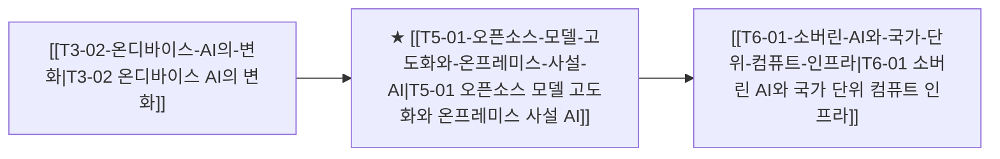

# T5-01 오픈소스 모델 고도화와 온프레미스 사설 AI

> 🧭 **상위 인덱스**: [[00-Argus-Master-MOC|Master MOC]] ➔ [[00-Argus-Master-MOC#4-🏛️-매크로-클라우드-금융--소프트웨어-과점-macro--ecosystem|매크로 & 빅테크 생태계]]

> 🏷️ **교차 분석 메타데이터**:
> - **성격**: `🚀 주류 성장 (Consensus)` | **스택**: `L4 (모델/SW)` | **시계**: `2026~2027`
> - **공급망 권역**: `US` | **핵심 대결 구도**: 해당 없음

---

## 🎯 핵심 가설
폐쇄형 프론티어 모델과 오픈소스(LLaMA 등) 모델 간 성능 격차가 축소되며 기업들이 데이터 주권을 위해 사설 인프라 투자를 늘린다

---

## 🔗 테제 네트워크 (상호 연관 가설)



- 🔼 **선행 가설 (배경 요인 & 상위 인프라)**:
  - [[T3-02-온디바이스-AI의-변화|T3-02 온디바이스 AI의 변화]] — 오픈소스 가중치 모델 경량화
- ➡️ **동반 및 대체·경쟁 가설**:
  - (해당 없음)
- 🔽 **파생 및 후행 병목 가설**:
  - [[T6-01-소버린-AI와-국가-단위-컴퓨트-인프라|T6-01 소버린 AI와 국가 단위 컴퓨트 인프라]] — 사설/국가 인프라 구축

---

## 🏢 연관 기업 & 핵심 기술 허브
- **핵심 기업**: [[Company-Meta|Meta]], [[Company-Dell|Dell]], [[Company-HPE|HPE]], [[Company-슈퍼마이크로|슈퍼마이크로]], [[Company-삼성SDS|삼성SDS]], [[Company-오픈AI|오픈AI]]
- **핵심 기술/토픽**: [[Topic-온디바이스AI|온디바이스AI]]

---

## 📈 지지 근거


---

## 📉 반박 근거
- 2026-09-05: 모건스탠리 모멘텀 TMT 지수 한 달 53.5% 급락으로 AI 설비 롱/소프트웨어 숏 포지션 동시 손실 및 아마존 고정단가 계약의 원가 전가 불가와 경쟁 심화발 capex라는 수익성·지속성 우려 제기
- 2026-09-04: 모건스탠리 모멘텀 TMT 지수 한 달 -53.5% 급락으로 AI 설비 롱 포지션 손실이 발생하고 아마존 등 고정단가 대형 계약의 원가 전가 불가 및 AI 투자 과열/수익성 압박 우려가 부각됨
- 2026-09-04: 모건스탠리 모멘텀 TMT 지수 한 달 53.5% 급락 속 AI 설비주 급락과 아마존 고정단가 계약의 원가 전가 불가로 AI 인프라 투자의 수익성·지속성에 대한 회의론 부각
- 2026-09-04: 모건스탠리 모멘텀 TMT 지수 한 달 53.5% 급락 및 AI 설비주 하락과 아마존 고정단가 계약의 원가 전가 불가, 경쟁 과열에 기인한 투자라는 지적 등 AI 인프라 투자 수요 둔화 및 수익성 리스크 부각

---

## 📑 관련 산출물 (자동 집계)

### 🤖 Dataview 실시간 역방향 링크
```dataview
TABLE file.mtime AS "작성일", angle AS "관점", tags AS "태그"
FROM "argus" OR "output" OR ""
WHERE contains(thesis, "T5-01") OR contains(thesis, "T5-01") OR contains(file.outlinks, this.file.link)
SORT file.mtime DESC
LIMIT 7
```

### 📌 수동 링크 아카이브


---

## 📝 분석가 메모

