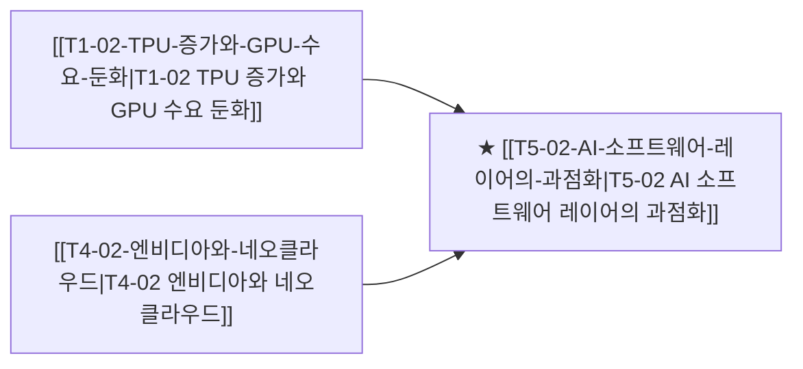

# T5-02 AI 소프트웨어 레이어의 과점화

> 🧭 **상위 인덱스**: [[00-Argus-Master-MOC|Master MOC]] ➔ [[00-Argus-Master-MOC#4-🏛️-매크로-클라우드-금융--소프트웨어-과점-macro--ecosystem|매크로 & 빅테크 생태계]]

> 🏷️ **교차 분석 메타데이터**:
> - **성격**: `🚀 주류 성장 (Consensus)` | **스택**: `L4 (모델/SW)` | **시계**: `2026~2027`
> - **공급망 권역**: `US` | **핵심 대결 구도**: 해당 없음

---

## 🎯 핵심 가설
AI 인프라 투자의 최종 수혜는 칩이 아닌 소프트웨어(모델·플랫폼·에이전트)로 이전되며, OpenAI·Anthropic·Google의 API 과점이 SaaS 기업 마진을 구조적으로 압박한다

---

## 🔗 테제 네트워크 (상호 연관 가설)



- 🔼 **선행 가설 (배경 요인 & 상위 인프라)**:
  - [[T1-02-TPU-증가와-GPU-수요-둔화|T1-02 TPU 증가와 GPU 수요 둔화]] — 빅테크 수직 계열화
  - [[T4-02-엔비디아와-네오클라우드|T4-02 엔비디아와 네오클라우드]] — 클라우드-모델 락인
- ➡️ **동반 및 대체·경쟁 가설**:
  - (해당 없음)
- 🔽 **파생 및 후행 병목 가설**:
  - (해당 없음)

---

## 🏢 연관 기업 & 핵심 기술 허브
- **핵심 기업**: [[Company-Microsoft|Microsoft]], [[Company-Salesforce|Salesforce]], [[Company-ServiceNow|ServiceNow]], [[Company-OpenAI|OpenAI]], [[Company-Anthropic|Anthropic]]
- **핵심 기술/토픽**: [[Topic-ASIC|ASIC]]

---

## 📈 지지 근거
<!-- 시스템이 자동으로 채워주거나 사용자가 직접 메모 -->

---

## 📉 반박 근거
- 2026-09-05: 증권사 리포트에서 AI 인프라 투자가 수요 강세가 아닌 경쟁 압박의 증거로 해석되고 아마존의 고정단가 계약으로 원가 전가가 불가하며 이수페타시스·삼성전기 등 기판 기업이 여전히 AI 서버 대표 수혜주로 제시되어 소프트웨어로의 수혜 이전을 입증할 신규 근거 부재
- 2026-09-04: 증권사 리포트에서 AI 수혜를 기판 기업(이수페타시스·삼성전기·대덕전자) 등 하드웨어 공급망으로 한정하고, 아마존 등 하이퍼스케일러의 고정단가 계약으로 원가 전가 불가 및 경쟁적 과잉투자를 지적하며, 모건스탠리 모멘텀 TMT 지수 한 달 53.5% 급락으로 롱 인프라/숏 소프트웨어 크라우딩 청산을 시사함
- 2026-09-04: 모건스탠리 모멘텀 TMT 지수 한 달 53.5% 급락 속 AI 설비 롱과 소프트웨어 숏 포지션 동시 손실 및 국내 리포트가 이수페타시스·삼성전기 등 기판을 AI 서버 대표 수혜주로 지목하고 아마존 고정단가 계약의 원가 전가 불가와 경쟁 과열에 따른 과잉투자 가능성을 지적한 점은 소프트웨어 과점의 안정적 렌트를 전제하는 가설을 위협함
- 2026-09-04: 모건스탠리 모멘텀 TMT 지수 한 달 53.5% 급락으로 AI 인프라 롱·소프트웨어 숏 포지션이 동시 손실되고, 증권사 리포트가 이수페타시스·삼성전기·대덕전자 등 AI 서버 기판 하드웨어를 대표 수혜로 지목하며 아마존의 고정단가 계약 원가 전가 불가를 지적해 소프트웨어 최종 수혜 가설과 배치되는 흐름이 관측됨
<!-- 가설에 반하는 뉴스/데이터 -->

---

## 📑 관련 산출물 (자동 집계)

### 🤖 Dataview 실시간 역방향 링크
```dataview
TABLE file.mtime AS "작성일", angle AS "관점", tags AS "태그"
FROM "argus" OR "output" OR ""
WHERE contains(thesis, "T5-02") OR contains(thesis, "T5-02") OR contains(file.outlinks, this.file.link)
SORT file.mtime DESC
LIMIT 7
```

### 📌 수동 링크 아카이브
<!-- `블로그 파일명` 형식으로 링크 -->

---

## 📝 분석가 메모
- 인프라(칩·서버) 마진 압축 vs 소프트웨어 마진 확대 구도
- 기존 SaaS 기업들의 AI 탑재 여부가 생존 기준이 될 수 있음


## 반박 근거
- 2026-09-06: 모건스탠리 모멘텀 TMT 지수 한 달 53.5% 급락 국면에서 AI 설비주 하락·소프트웨어주 상승이 펀더멘털 개선이 아닌 레버리지 청산·숏커버링으로 발생했고, 증권사 리포트는 여전히 이수페타시스 등 기판/서버 하드웨어를 AI 수혜주로 주목하며 아마존 고정단가 계약의 원가 전가 불가로 플랫폼 레이어의 가격결정력 가설이 약화됨