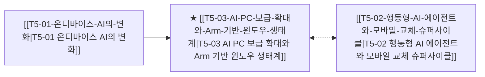

# T5-03 AI PC 보급 확대와 Arm 기반 윈도우 생태계

> 🧭 **상위 인덱스**: [[00-Argus-Master-MOC|Master MOC]] ➔ [[00-Argus-Master-MOC#3-🤖-피지컬-ai-로보틱스--엣지-디바이스-physical-ai--edge|피지컬 AI & 엣지 디바이스]]

> 🏷️ **교차 분석 메타데이터**:
> - **성격**: `🚀 주류 성장 (Consensus)` | **스택**: `L5 (디바이스)` | **시계**: `2026~2027`
> - **공급망 권역**: `US` | **핵심 대결 구도**: 해당 없음

---

## 🎯 핵심 가설
45 TOPS 이상의 NPU가 탑재된 Arm 기반 SoC(스냅드래곤 X 시리즈 등)가 x86의 점유율을 잠식하며 PC 아키텍처 재편이 일어난다

---

## 🔗 테제 네트워크 (상호 연관 가설)



- 🔼 **선행 가설 (배경 요인 & 상위 인프라)**:
  - [[T5-01-온디바이스-AI의-변화|T5-01 온디바이스 AI의 변화]] — 40+ TOPS NPU 표준화
- ➡️ **동반 및 대체·경쟁 가설**:
  - [[T5-02-행동형-AI-에이전트와-모바일-교체-슈퍼사이클|T5-02 행동형 AI 에이전트와 모바일 교체 슈퍼사이클]] — 디바이스 생태계 연계
- 🔽 **파생 및 후행 병목 가설**:
  - (해당 없음)

---

## 🏢 연관 기업 & 핵심 기술 허브
- **핵심 기업**: [[Company-Qualcomm|Qualcomm]], [[Company-Intel|인텔]], [[Company-AMD|AMD]], [[Company-Microsoft|Microsoft]], [[Company-ARM|ARM]], [[Company-Lenovo|Lenovo]]
- **핵심 기술/토픽**: [[Topic-온디바이스AI|온디바이스AI]], [[Topic-ASIC|ASIC]]

---

## 📈 지지 근거


---

## 📉 반박 근거
- 2026-09-04: 증권사 리포트들이 AI 가속기 수요를 GPU/HBM 및 서버용 메모리 중심으로만 서술하며 45 TOPS NPU·Arm SoC 기반 AI PC의 x86 잠식 관련 모멘텀은 전혀 언급되지 않음

---

## 📑 관련 산출물 (자동 집계)

### 🤖 Dataview 실시간 역방향 링크
```dataview
TABLE file.mtime AS "작성일", angle AS "관점", tags AS "태그"
FROM "argus" OR "output" OR ""
WHERE contains(thesis, "T2-07") OR contains(thesis, "T2-07") OR contains(file.outlinks, this.file.link)
SORT file.mtime DESC
LIMIT 7
```

### 📌 수동 링크 아카이브


---

## 📝 분석가 메모

