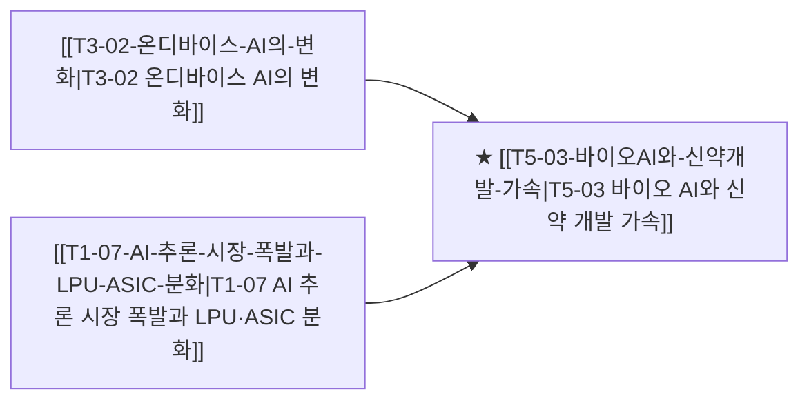

# T5-03 바이오 AI와 신약 개발 가속

> 🧭 **상위 인덱스**: [[00-Argus-Master-MOC|Master MOC]] ➔ [[00-Argus-Master-MOC#3-🤖-피지컬-ai-로보틱스--엣지-디바이스-physical-ai--edge|피지컬 AI & 엣지 디바이스]]

> 🏷️ **교차 분석 메타데이터**:
> - **성격**: `🚀 주류 성장 (Consensus)` | **스택**: `L4 (모델/SW)` | **시계**: `2026~2028`
> - **공급망 권역**: `US`, `KR` | **핵심 대결 구도**: 해당 없음

---

## 🎯 핵심 가설
AlphaFold3 이후 AI 신약 개발이 임상 성공률을 구조적으로 높이고, K-바이오의 글로벌 기술수출과 CMO/CDMO 수주가 가속된다

---

## 🔗 테제 네트워크 (상호 연관 가설)



- 🔼 **선행 가설 (배경 요인 & 상위 인프라)**:
  - [[T3-02-온디바이스-AI의-변화|T3-02 온디바이스 AI의 변화]] — 바이오 AI 모델 연산
  - [[T1-07-AI-추론-시장-폭발과-LPU-ASIC-분화|T1-07 AI 추론 시장 폭발과 LPU·ASIC 분화]] — 단백질 구조 추론 가속
- ➡️ **동반 및 대체·경쟁 가설**:
  - (해당 없음)
- 🔽 **파생 및 후행 병목 가설**:
  - (해당 없음)

---

## 🏢 연관 기업 & 핵심 기술 허브
- **핵심 기업**: [[Company-삼성바이오로직스|삼성바이오로직스]], [[Company-셀트리온|셀트리온]], [[Company-유한양행|유한양행]], [[Company-알테오젠|알테오젠]], [[Company-Recursion|Recursion]]
- **핵심 기술/토픽**: [[Topic-ASIC|ASIC]]

---

## 📈 지지 근거
<!-- 시스템이 자동으로 채워주거나 사용자가 직접 메모 -->

---

## 📉 반박 근거
<!-- 가설에 반하는 뉴스/데이터 -->

---

## 📑 관련 산출물 (자동 집계)

### 🤖 Dataview 실시간 역방향 링크
```dataview
TABLE file.mtime AS "작성일", angle AS "관점", tags AS "태그"
FROM "argus" OR "output" OR ""
WHERE contains(thesis, "T5-03") OR contains(thesis, "T5-03") OR contains(file.outlinks, this.file.link)
SORT file.mtime DESC
LIMIT 7
```

### 📌 수동 링크 아카이브
<!-- `블로그 파일명` 형식으로 링크 -->

---

## 📝 분석가 메모
- 후보물질 탐색 기간: 10년 → 2년 (AI 적용 시)
- CMO/CDMO는 AI 신약 증가의 직접 수혜
