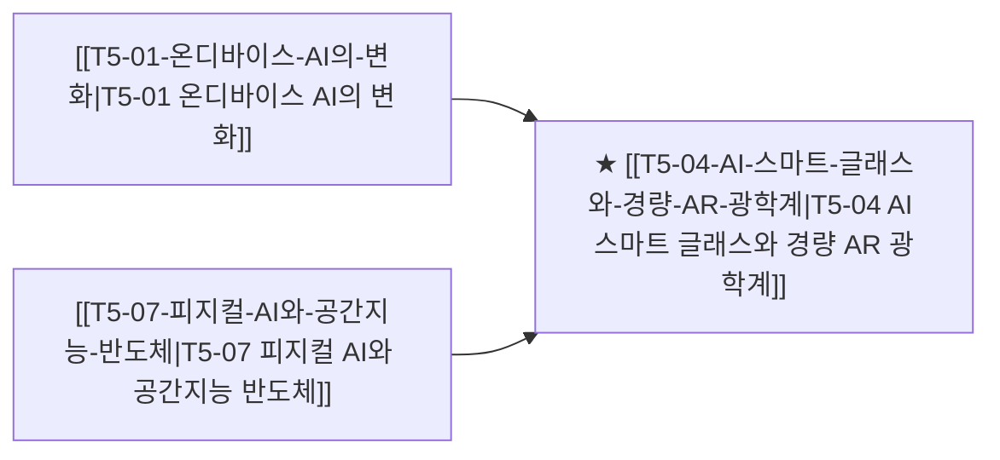

# T5-04 AI 스마트 글래스와 경량 AR 광학계

> 🧭 **상위 인덱스**: [[00-Argus-Master-MOC|Master MOC]] ➔ [[00-Argus-Master-MOC#3-🤖-피지컬-ai-로보틱스--엣지-디바이스-physical-ai--edge|피지컬 AI & 엣지 디바이스]]

> 🏷️ **교차 분석 메타데이터**:
> - **성격**: `🚀 주류 성장 (Consensus)` | **스택**: `L5 (디바이스)` | **시계**: `2026~2027`
> - **공급망 권역**: `US`, `KR` | **핵심 대결 구도**: 해당 없음

---

## 🎯 핵심 가설
디스플레이 없는 음성/비전 AI 스마트 안경(Ray-Ban 메타 등)의 성공이 차세대 경량 AR 글래스 및 마이크로 OLED 시장을 견인한다

---

## 🔗 테제 네트워크 (상호 연관 가설)



- 🔼 **선행 가설 (배경 요인 & 상위 인프라)**:
  - [[T5-01-온디바이스-AI의-변화|T5-01 온디바이스 AI의 변화]] — 초저전력 엣지 NPU
  - [[T5-07-피지컬-AI와-공간지능-반도체|T5-07 피지컬 AI와 공간지능 반도체]] — 공간 인식 광학계
- ➡️ **동반 및 대체·경쟁 가설**:
  - (해당 없음)
- 🔽 **파생 및 후행 병목 가설**:
  - (해당 없음)

---

## 🏢 연관 기업 & 핵심 기술 허브
- **핵심 기업**: [[Company-Meta|Meta]], [[Company-EssilorLuxottica|EssilorLuxottica]], [[Company-LG디스플레이|LG디스플레이]], [[Company-Sony|Sony]], [[Company-Apple|Apple]]
- **핵심 기술/토픽**: [[Topic-온디바이스AI|온디바이스AI]], [[Topic-피지컬AI|피지컬AI]]

---

## 📈 지지 근거


---

## 📉 반박 근거


---

## 📑 관련 산출물 (자동 집계)

### 🤖 Dataview 실시간 역방향 링크
```dataview
TABLE file.mtime AS "작성일", angle AS "관점", tags AS "태그"
FROM "argus" OR "output" OR ""
WHERE contains(thesis, "T2-08") OR contains(thesis, "T2-08") OR contains(file.outlinks, this.file.link)
SORT file.mtime DESC
LIMIT 7
```

### 📌 수동 링크 아카이브


---

## 📝 분석가 메모

