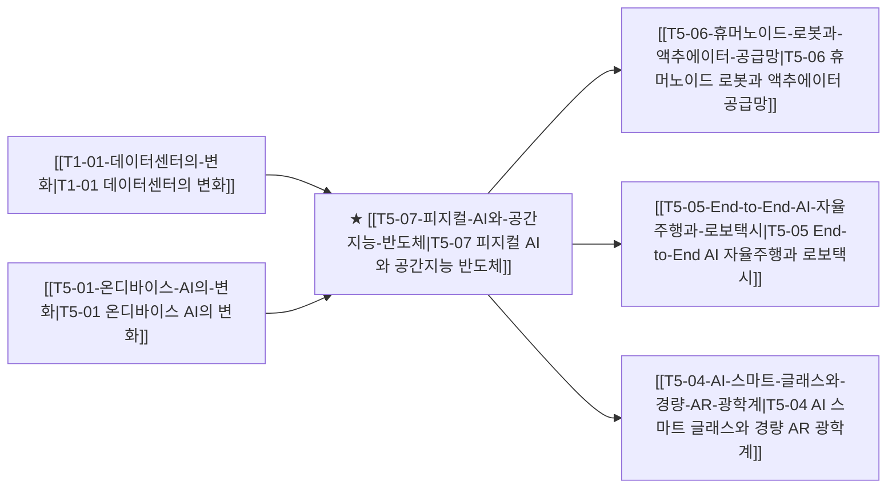

# T5-07 피지컬 AI와 공간지능 반도체

> 🧭 **상위 인덱스**: [[00-Argus-Master-MOC|Master MOC]] ➔ [[00-Argus-Master-MOC#3-🤖-피지컬-ai-로보틱스--엣지-디바이스-physical-ai--edge|피지컬 AI & 엣지 디바이스]]

> 🏷️ **교차 분석 메타데이터**:
> - **성격**: `🚀 주류 성장 (Consensus)` | **스택**: `L1 (칩/패키징)` | **시계**: `2026~2028`
> - **공급망 권역**: `US`, `JP` | **핵심 대결 구도**: 해당 없음

---

## 🎯 핵심 가설
텍스트/이미지를 넘어 3차원 공간과 물리 법칙을 이해하는 공간지능(Spatial AI) 전용 칩이 스마트팩토리와 로봇의 핵심 뇌가 된다

---

## 🔗 테제 네트워크 (상호 연관 가설)



- 🔼 **선행 가설 (배경 요인 & 상위 인프라)**:
  - [[T1-01-데이터센터의-변화|T1-01 데이터센터의 변화]] — 물리 엔진 학습 컴퓨트
  - [[T5-01-온디바이스-AI의-변화|T5-01 온디바이스 AI의 변화]] — 엣지 공간 지능 추론
- ➡️ **동반 및 대체·경쟁 가설**:
  - (해당 없음)
- 🔽 **파생 및 후행 병목 가설**:
  - [[T5-06-휴머노이드-로봇과-액추에이터-공급망|T5-06 휴머노이드 로봇과 액추에이터 공급망]] — 물리 에이전트 구동
  - [[T5-05-End-to-End-AI-자율주행과-로보택시|T5-05 End-to-End AI 자율주행과 로보택시]] — 완전자율주행 구현
  - [[T5-04-AI-스마트-글래스와-경량-AR-광학계|T5-04 AI 스마트 글래스와 경량 AR 광학계]] — 공간 컴퓨팅 인터페이스

---

## 🏢 연관 기업 & 핵심 기술 허브
- **핵심 기업**: [[Company-NVIDIA|NVIDIA]], [[Company-Apple|Apple]], [[Company-Qualcomm|Qualcomm]], [[Company-삼성전자|삼성전자]], [[Company-Sony|Sony]]
- **핵심 기술/토픽**: [[Topic-피지컬AI|피지컬AI]], [[Topic-자율주행|자율주행]], [[Topic-온디바이스AI|온디바이스AI]]

---

## 📈 지지 근거


---

## 📉 반박 근거
- 2026-09-05: AI 설비 관련 종목의 주가 급락과 경쟁 심화로 인한 투자 회수 리스크가 부각되고 있으나, 공간지능 반도체에 직접적으로 대응되는 반박은 제한적입니다.
- 2026-09-04: 모건스탠리 모멘텀 TMT 지수 한 달간 53.5% 급락하며 AI 설비주 하락·레버리지 청산 압력이 부각되고, 대규모 AI 투자가 수요 강세가 아닌 경쟁 과열 신호이며 아마존 고정단가 계약의 원가 전가 불가로 인프라 수익성 우려가 확대됨
- 2026-09-04: 모건스탠리 모멘텀 TMT 지수 한 달간 53.5% 급락으로 AI 설비 종목 중심의 모멘텀 붕괴와 레버리지 청산이 발생했고, AI 투자가 견조한 수요가 아닌 주도권 경쟁에 따른 과잉투자이며 아마존 등 고정단가 계약으로 원가 전가가 불가하다는 분석이 제기됨
- 2026-09-04: 모건스탠리 모멘텀 TMT 지수 한 달 53.5% 급락으로 AI 설비주 약세·레버리지 청산 진행 중이며, AI 인프라 투자는 견조한 수요보다 경쟁 압박에 의한 과잉지출이고 아마존처럼 고정단가 계약으로 원가 전가가 불가하다는 수익성 우려 제기

---

## 📑 관련 산출물 (자동 집계)

### 🤖 Dataview 실시간 역방향 링크
```dataview
TABLE file.mtime AS "작성일", angle AS "관점", tags AS "태그"
FROM "argus" OR "output" OR ""
WHERE contains(thesis, "T2-05") OR contains(thesis, "T2-05") OR contains(file.outlinks, this.file.link)
SORT file.mtime DESC
LIMIT 7
```

### 📌 수동 링크 아카이브


---

## 📝 분석가 메모


## 반박 근거
- 2026-09-06: AI 설비 종목의 급격한 가격 조정과 경쟁 심화로 인한 하드웨어 투자 수익성 우려가 제기되고 있다.