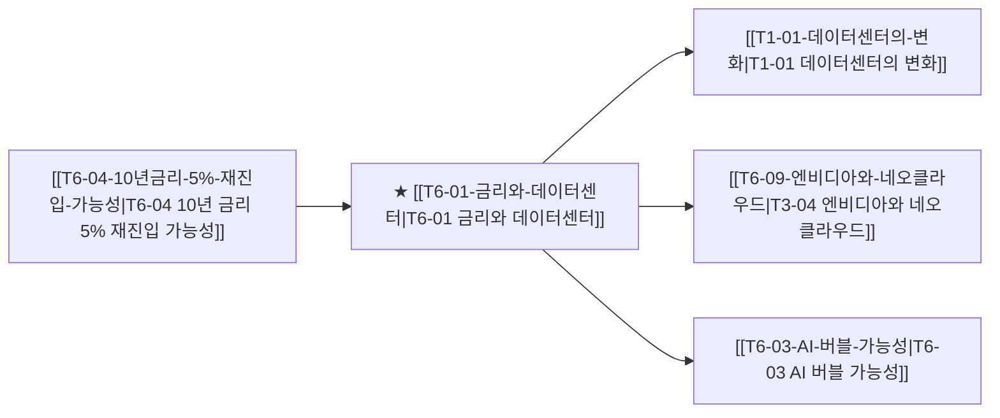

# T6-01 금리와 데이터센터

> 🧭 **상위 인덱스**: [[00-Argus-Master-MOC|Master MOC]] ➔ [[00-Argus-Master-MOC#2-⚡-ai-데이터센터--전력냉각-인프라-power--infrastructure|AI 인프라 & 전력·냉각]]

> 🏷️ **교차 분석 메타데이터**:
> - **성격**: `🛡️ 역발상/헷지 (Contrarian)` | **스택**: `L3 (클라우드)` | **시계**: `2026~2027`
> - **공급망 권역**: `US` | **핵심 대결 구도**: 해당 없음

---

## 🎯 핵심 가설
고금리 지속 시 빅테크 AI CAPEX가 ROIC 검증 압력에 직면하고 DC 투자 속도가 둔화된다

---

## 🔗 테제 네트워크 (상호 연관 가설)



- 🔼 **선행 가설 (배경 요인 & 상위 인프라)**:
  - [[T6-04-10년금리-5%-재진입-가능성|T6-04 10년 금리 5% 재진입 가능성]] — 매크로 고금리 장기화
- ➡️ **동반 및 대체·경쟁 가설**:
  - (해당 없음)
- 🔽 **파생 및 후행 병목 가설**:
  - [[T1-01-데이터센터의-변화|T1-01 데이터센터의 변화]] — CAPEX ROI 검증 압박
  - [[T6-09-엔비디아와-네오클라우드|T3-04 엔비디아와 네오클라우드]] — GPU 리스 부채 비용 급증
  - [[T6-03-AI-버블-가능성|T6-03 AI 버블 가능성]] — 수익화 지연 시 버블 붕괴

---

## 🏢 연관 기업 & 핵심 기술 허브
- **핵심 기업**: [[Company-Microsoft|Microsoft]], [[Company-Google|Google]], [[Company-Amazon|Amazon]], [[Company-Meta|Meta]], [[Company-Oracle|Oracle]]
- **핵심 기술/토픽**: [[Topic-전력그리드|전력그리드]], [[Topic-ASIC|ASIC]]

---

## 📈 지지 근거
- 2026-09-05: 고금리 환경에서 빅테크가 자본비용(ROIC) 압박을 받으며 무차별적 증설 대신 수익성 위주의 CAPEX 선별 집행을 진행 중이라는 분석이 확인되었다.
- 2026-09-04: 고금리 환경에서 자본비용 압박에 따른 빅테크의 ROIC 검증 및 무차별적 증설 대신 수익성 중심의 선별적 CAPEX 집행 기조가 리포트를 통해 확인됨.
- 2026-09-04: 증권사 리포트에서 고금리 환경의 자본비용 압박 속 메모리가 AI 인프라 예산을 집어삼키는 최대 병목/포식자로 부상하고 수익성 위주의 CAPEX 선별 집행과 전력망 부담에 따른 인허가 규제 리스크가 병기됨
- 2026-09-04: 메모리 가격 '100년 만의 홍수' 속 AI DC 예산의 최대 병목이 GPU/CPU에서 메모리로 전환됐고 고금리 자본비용 압박 속 빅테크 ROIC 검증 및 수익성 위주 선별적 CAPEX 집행이 복수 리포트에서 관측됨

---

## 📉 반박 근거
- 2026-09-04: 메모리 가격 '100년 만의 홍수' 발언과 '생산능력 확대 지속' 언급은 비용 압박에도 불구하고 단기 AI DC 수요와 증설 모멘텀이 여전히 견조해 즉각적 투자 둔화 관측은 없음을 시사
- 2026-09-04: 그럼에도 메모리 생산능력 확대가 지속되고 있어 투자 수요 자체의 붕괴가 아닌 선별적 속도조절에 그칠 리스크가 존재함

---

## 📑 관련 산출물 (자동 집계)

### 🤖 Dataview 실시간 역방향 링크
```dataview
TABLE file.mtime AS "작성일", angle AS "관점", tags AS "태그"
FROM "argus" OR "output" OR ""
WHERE contains(thesis, "T4-01") OR contains(thesis, "T4-01") OR contains(file.outlinks, this.file.link)
SORT file.mtime DESC
LIMIT 7
```

### 📌 수동 링크 아카이브


---

## 📝 분석가 메모


## 지지 근거
- 2026-09-06: 고금리 환경에서 빅테크가 자본비용 및 ROIC 압박을 받으며 무차별적 증설 대신 수익성 위주의 선별적 CAPEX 집행으로 전환하고 있다는 분석이 확인됨.