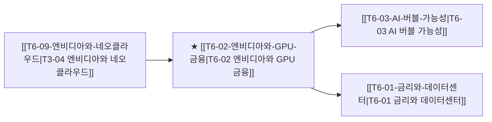

# T6-02 엔비디아와 GPU 금융

> 🧭 **상위 인덱스**: [[00-Argus-Master-MOC|Master MOC]] ➔ [[00-Argus-Master-MOC#4-🏛️-매크로-클라우드-금융--소프트웨어-과점-macro--ecosystem|매크로 & 빅테크 생태계]]

> 🏷️ **교차 분석 메타데이터**:
> - **성격**: `🛡️ 역발상/헷지 (Contrarian)` | **스택**: `L3 (클라우드)` | **시계**: `2026~2027`
> - **공급망 권역**: `US` | **핵심 대결 구도**: 해당 없음

---

## 🎯 핵심 가설
GPU 담보 대출(칩담대) 시장이 AI 서브프라임 리스크를 만들고 있다

---

## 🔗 테제 네트워크 (상호 연관 가설)



- 🔼 **선행 가설 (배경 요인 & 상위 인프라)**:
  - [[T6-09-엔비디아와-네오클라우드|T3-04 엔비디아와 네오클라우드]] — GPU 자산화 및 금융 결합
- ➡️ **동반 및 대체·경쟁 가설**:
  - (해당 없음)
- 🔽 **파생 및 후행 병목 가설**:
  - [[T6-03-AI-버블-가능성|T6-03 AI 버블 가능성]] — GPU 감가상각 및 담보 가치 하락
  - [[T6-01-금리와-데이터센터|T6-01 금리와 데이터센터]] — 부채 조달 한계

---

## 🏢 연관 기업 & 핵심 기술 허브
- **핵심 기업**: [[Company-NVIDIA|NVIDIA]], [[Company-CoreWeave|CoreWeave]], [[Company-Blackstone|Blackstone]], [[Company-JPMorgan|JPMorgan]], [[Company-Goldman Sachs|Goldman Sachs]]
- **핵심 기술/토픽**: [[Topic-ASIC|ASIC]]

---

## 📈 지지 근거
- 2026-09-04: 빅테크가 고금리 환경에서 자본비용 압박 및 ROIC 저하 리스크에 직면하고 있다는 언급이 있으나 구체적인 금융 리스크 수치는 제시되지 않았습니다.

---

## 📉 반박 근거
- 2026-09-05: 증권사 리포트에서 GPU·HBM이 AI 가속기 핵심으로 지속 수요가 확인되고 서버용 CPU/GPU용 고부가 기판 수요/공급이 타이트하다고 언급해 GPU 담보가치 붕괴 가정을 반박함
- 2026-09-04: 한국IR협의회 리포트들이 GPU/HBM을 생성형AI 필수 가속기로 규정하고 서버용 CPU/GPU용 FC-BGA 수급이 타이트하다고 언급해 GPU 담보가치 급락 전제와 상충
- 2026-09-04: 서버용 CPU/GPU 및 관련 고부가 부품에 대한 수요는 여전히 타이트하게 유지되고 있습니다.

---

## 📑 관련 산출물 (자동 집계)

### 🤖 Dataview 실시간 역방향 링크
```dataview
TABLE file.mtime AS "작성일", angle AS "관점", tags AS "태그"
FROM "argus" OR "output" OR ""
WHERE contains(thesis, "T4-03") OR contains(thesis, "T4-03") OR contains(file.outlinks, this.file.link)
SORT file.mtime DESC
LIMIT 7
```

### 📌 수동 링크 아카이브


---

## 📝 분석가 메모


## 반박 근거
- 2026-09-06: 증권사 리포트들이 GPU·HBM·FC-BGA 고부가 패키지 기판 수급이 타이트하고 AI 가속기 수요가 견조함을 강조하며 GPU 담보가치 폭락 전제에 대한 반정황을 시사