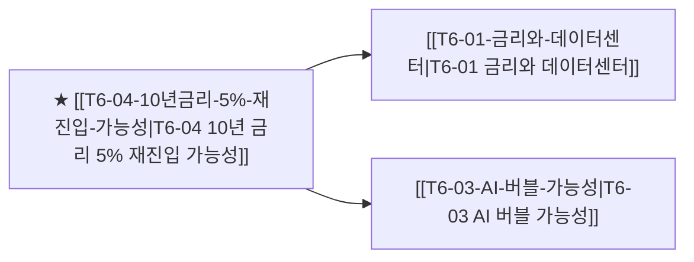

# T4-05 10년 금리 5% 재진입 가능성

> 🧭 **상위 인덱스**: [[00-Argus-Master-MOC|Master MOC]] ➔ [[00-Argus-Master-MOC#4-🏛️-매크로-클라우드-금융--소프트웨어-과점-macro--ecosystem|매크로 & 빅테크 생태계]]

> 🏷️ **교차 분석 메타데이터**:
> - **성격**: `🛡️ 역발상/헷지 (Contrarian)` | **스택**: `L6 (매크로)` | **시계**: `2026~2027`
> - **공급망 권역**: `US` | **핵심 대결 구도**: 해당 없음

---

## 🎯 핵심 가설
미국 재정적자 구조화, AI 인프라 CAPEX 채권 수요 증가, 인플레이션 재점화가 겹치면서 미국 10년물 국채 금리가 5%를 재돌파하고 장기간 유지될 수 있다

---

## 🔗 테제 네트워크 (상호 연관 가설)



- 🔼 **선행 가설 (배경 요인 & 상위 인프라)**:
  - (독립적 기저 요인)
- ➡️ **동반 및 대체·경쟁 가설**:
  - (해당 없음)
- 🔽 **파생 및 후행 병목 가설**:
  - [[T6-01-금리와-데이터센터|T6-01 금리와 데이터센터]] — 빅테크 WACC 급등 및 CAPEX 위축
  - [[T6-03-AI-버블-가능성|T6-03 AI 버블 가능성]] — 밸류에이션 디레이팅 촉발

---

## 🏢 연관 기업 & 핵심 기술 허브
- **핵심 기업**: [[Company-Vanguard|Vanguard]], [[Company-iShares|iShares]], [[Company-미국재무부|미국재무부]], [[Company-빅테크전반|빅테크전반]]
- **핵심 기술/토픽**: [[Topic-전력그리드|전력그리드]]

---

## 📈 지지 근거
<!-- 시스템이 자동으로 채워주거나 사용자가 직접 메모 -->

---

## 📉 반박 근거
<!-- 가설에 반하는 뉴스/데이터 -->

---

## 📑 관련 산출물 (자동 집계)

### 🤖 Dataview 실시간 역방향 링크
```dataview
TABLE file.mtime AS "작성일", angle AS "관점", tags AS "태그"
FROM "argus" OR "output" OR ""
WHERE contains(thesis, "T4-05") OR contains(thesis, "T4-05") OR contains(file.outlinks, this.file.link)
SORT file.mtime DESC
LIMIT 7
```

### 📌 수동 링크 아카이브
<!-- `블로그 파일명` 형식으로 링크 -->

---

## 📝 분석가 메모
- Bearish Macro Thesis — 전체 포트폴리오의 리스크 헤지 관점
- FOMC 성명, 미국 CPI, 미국 재정적자 수치를 핵심 지표로 추적
- 10년물 4.5% 이상 유지 시 경보 레벨 상향
