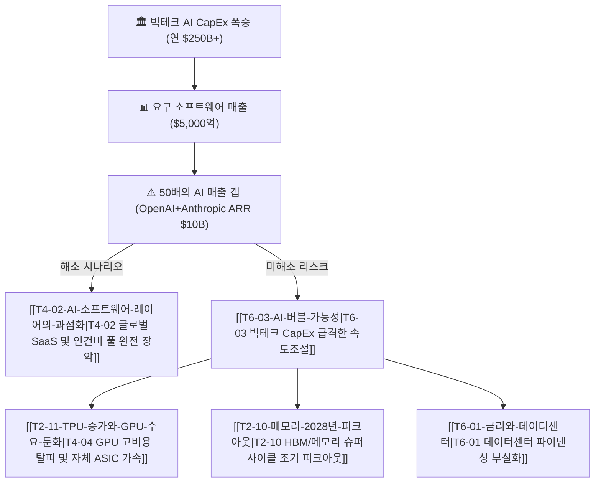

# T6-05 오픈AI·앤트로픽의 5000억 달러 매출 갭과 데이터센터 ROI 딜레마

> **역발상/리스크 헷지 가설 (Contrarian / CapEx ROI Crunch)**  
> 글로벌 빅테크와 클라우드가 쏟아붓는 **연간 $2,000억~$3,000억 이상의 AI CapEx가 정당화되려면 인프라의 절반을 소화하는 프론티어 AI(OpenAI + Anthropic)가 연간 $5,000억(약 680조 원)의 매출을 올려야 한다는 구조적 역설**과, 이 매출 갭이 해소되지 못할 때 닥쳐올 인프라 투자 절벽 및 밸류에이션 디레이팅을 추적합니다.

---

## 1. $5,000억 달러 매출 요건의 수학적 산출 근거 (The $500B Math)

```
[글로벌 AI 데이터센터 인프라 CapEx ($2,500억+/년)]
        │
        ▼ (하드웨어 4년 감가상각 + 전력·운영비 OPEX + 클라우드 마진 50%)
[생태계 전체 요구 소프트웨어 매출: 연간 약 $8,000억 ~ $1조]
        │
        ▼ (인프라 용량의 50%를 프론티어 LLM 2개사가 소화한다고 가정)
[OpenAI + Anthropic 요구 연매출 = $5,000억 ($500B)]
        │
        ▼ (2026년 현재 양사 합산 ARR 약 $100억 내외)
[★ 약 $4,900억(50배)의 거대한 'AI 매출 갭(Revenue Gap)' 존재]
```

1. **인프라 감가상각과 손익분기점(BEP)의 냉정한 계산**:
   * 빅테크 4사(MS, 구글, 아마존, 메타) 및 네오클라우드의 AI 인프라 누적 투자액은 수년 내 1조 달러를 돌파할 전망입니다.
   * AI 가속기(GPU/ASIC)의 짧은 제품 수명(3~4년)과 막대한 전력·냉각 비용을 감안할 때, 자본비용(WACC) 이상의 수익을 거두려면 연간 **최소 $8,000억 이상의 최종 GenAI 서비스 매출**이 창출되어야 합니다.
   * 이 인프라의 절반을 OpenAI와 Anthropic의 모델 추론/학습이 차지한다면, **두 회사의 연간 합산 매출은 $5,000억(전 세계 스마트폰 시장 전체 규모, 애플 연매출의 1.2배)에 도달해야만 경제성이 성립**합니다.

2. **현재 현실과의 괴리 (50배의 갭)**:
   * 현재 OpenAI의 ARR은 약 $40억~$100억, Anthropic은 $10억~$30억 수준입니다.
   * 양사가 $5,000억을 달성하려면 전 세계 모든 엔터프라이즈 SaaS 소프트웨어 시장(약 $3,500억)을 전부 먹어치우거나, 수조 달러 규모의 글로벌 지식 노동자 인건비(Payroll)를 실질적으로 대체해야 합니다.

---

## 2. 3대 수익화 병목과 마진 붕괴 요인 (Monetization Bottlenecks)

1. **토큰 가격 디플레이션 (Price Deflation)**:
   * 메타의 Llama 등 오픈소스 모델의 맹추격과 프론티어 랩 간의 출혈 경쟁으로 100만 토큰당 API 가격이 매년 70% 이상 폭락하고 있습니다.
2. **추론 한계비용의 비(非)제로화 (Non-Zero Marginal Cost)**:
   * 과거 SaaS는 유저가 늘어도 서버 비용 증가가 미미해 80% 이상의 총마진(Gross Margin)을 누렸으나, LLM 추론은 사용량에 비례해 정직하게 GPU 연산 비용이 발생하므로 마진율이 40~50% 수준으로 제한됩니다.
3. **기업 업무 도입의 마찰 (Enterprise Friction)**:
   * 환각(Hallucination), 데이터 보안, 레거시 ERP/CRM과의 통합 비용 문제로 단순 API 호출을 넘어선 실질적 기업 워크플로우 결제 전환 속도가 예상보다 완만합니다.

---

## 3. 밸류체인 및 인과관계 맵 (Value Chain Map)



---

## 4. 3대 전개 시나리오 및 투자 시사점

| 구분 | 시나리오 A: 생산성 슈퍼사이클 (강세) | 시나리오 B: CapEx 다이어트 & ASIC 전환 (중립) | 시나리오 C: AI 인프라 버블 조정 (약세) |
| :--- | :--- | :--- | :--- |
| **전개 조건** | AI 에이전트가 사무직 노동력 20% 대체<br>SaaS 시장 완전 흡수 | 고가 GPU 비중을 줄이고 자체 저비용 ASIC/TPU 비중 70%로 확대 | 구독 해지율 증가 및 기업 AI ROI 실망<br>빅테크 CapEx 삭감 발표 |
| **필요 매출** | 연간 $5,000억 달성 (지식노동 인건비 TAM 장악) | 인프라 비용 절감으로 필요 매출 $1,500억으로 하향 | 매출 갭 미해소로 수천억 달러 인프라 손상차손 |
| **수혜주** | OpenAI, Anthropic, MS, Alphabet, Meta | Broadcom, Marvell, ASIC 설계 파트너 | 방어주, 현금 흐름 우수 전통 가치주 |
| **피해/조정주**| 전통 엔터프라이즈 레거시 소프트웨어사 | 초고마진 독점 GPU 제조사 (엔비디아 ASP 압박) | AI 인프라 밸류체인 전반 (GPU, HBM, 전력) |

---

## 5. 핵심 수혜 및 피해 기업 (Winners & Losers)

- **생존 및 돌파 기업 (수익화 주도권)**:
  * **[[Company-OpenAI|OpenAI]]**, **[[Company-Anthropic|Anthropic]]**: 킬러 에이전트 출시 및 기업당 수백만 달러 규모의 엔터프라이즈 독점 계약 체결 여부.
  * **[[Company-Microsoft|Microsoft]] (MSFT)**: OpenAI 모델을 Copilot 및 Azure 기업 클라우드에 번들링하여 실제 캐시플로우 창출.
  * **[[Company-Alphabet|Alphabet]] (GOOGL)**: 자체 TPU 및 풀스택 AI로 추론 단위비용을 가장 낮게 방어 가능.
- **마진 압박 및 CapEx 축소 리스크 기업**:
  * **[[Company-NVIDIA|NVIDIA]] (NVDA)**: 고객사(빅테크/AI랩)의 ROI 딜레마로 인한 차세대 칩(Rubin 등) 구매 지연 및 가격 인하 압박.
  * **[[Company-SK하이닉스|SK하이닉스]] / [[Company-삼성전자|삼성전자]]**: AI 인프라 투자 속도 조절 시 HBM 프리미엄 축소 및 범용 전환 압력.
  * **레거시 SaaS 기업**: AI 에이전트에 의해 좌석당(Per-seat) 라이선스 비즈니스 모델 붕괴 위험.

---

## 6. 핵심 마일스톤 및 모니터링 트리거 (Milestones)

- [ ] **2026 하반기**: OpenAI + Anthropic 합산 연간 환산 매출(ARR) $250억 돌파 여부 (성장률 지속성 검증).
- [ ] **2027 상반기**: 포춘 500대 기업 중 AI 도입으로 인한 실제 인건비/SaaS 예산 절감 보고서 비중 30% 초과 여부.
- [ ] **2027 하반기**: 마이크로소프트·아마존·구글 중 1곳 이상의 AI 인프라 CapEx 가이던스 동결 또는 하향 조정 발표 여부.

---

## 7. 📊 관련 동적 데이터 및 다이제스트

```dataview
TABLE file.mtime AS "수정일", tags AS "태그"
FROM "argus" OR "outputs"
WHERE contains(file.outlinks, this.file.link) OR contains(keywords, "OpenAI") OR contains(keywords, "Anthropic") OR contains(keywords, "CapEx")
SORT file.mtime DESC
LIMIT 10
```


## 지지 근거
- 2026-09-06: 대신증권 뷰가 매크로 불확실성 속 AI 데이터센터 CAPEX를 '수익성 위주 선별 집행'으로 전환하고 AI 매출 전환율 10% 돌파 여부를 핵심 모니터링 지표로 제시해 ROI 입증 없이는 증설 지속이 어렵다는 딜레마를 재확인함.

## 반박 근거
- 2026-09-06: HD현대일렉트릭 리포트에서 20MW 초과 AI 데이터센터 계통연계 신속화 지시와 고압/초고압 전력기기 공급부족에 따른 발주 당김을 언급해 2025~2026년 단기 CapEx 절벽보다는 인프라 수요 강세가 지속됨을 시사함.