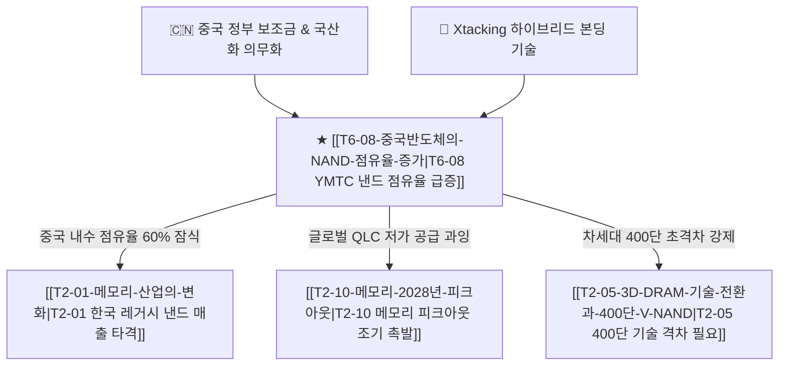

# T6-03 중국 반도체의 NAND 점유율 증가와 레거시·eSSD 잠식

> **역발상/헷지 가설 (Contrarian / Margin Pressure)**  
> D램/HBM과 달리 노광 장비(EUV) 제재의 영향이 상대적으로 덜한 **3D 낸드 분야에서 YMTC의 독자 아키텍처(Xtacking)와 막대한 정부 보조금을 무기로 한 중국산 낸드의 글로벌 침투**와 그에 따른 한국 메모리 기업들의 중장기 마진 훼손 리스크를 추적합니다.

---

## 1. 핵심 논리 및 배경 (Core Thesis Logic)

1. **NAND 공정의 제재 우회 용이성**:
   * D램/선단 로직은 7nm 이하 EUV 노광 장비가 필수적이지만, 3D 낸드는 DUV 노광기와 **식각(Etching)·증착(Deposition) 기술의 적층 수 싸움**이 핵심입니다.
   * YMTC는 식각/증착 장비 국산화율(NAURA, AMEC 등 60%+)을 높이며 미국의 제재망을 가장 빠르게 돌파하고 있습니다.
2. **독자 아키텍처 Xtacking(엑스태킹)의 수율 우위**:
   * 주변부 회로(Peri)와 메모리 셀(Cell)을 각각 다른 웨이퍼에서 생산한 뒤 본딩하는 **Xtacking 3.0/4.0 하이브리드 본딩**을 선제 상용화하여 232단 및 300단급 낸드에서 글로벌 선두권과 대등한 비트 밀도(Bit Density)를 확보했습니다.
3. **내수 시장 강제 할당과 글로벌 eSSD 저가 침투**:
   * 중국 정부의 '이구환신(신제품 교체)' 및 공공기관 국산 PC/서버 의무화로 화웨이, 레노버, 샤오미 스마트폰 및 알리바바, 텐센트 데이터센터의 YMTC 낸드 채택률이 급상승 중입니다.
   * 내수에서 축적된 현금 흐름을 바탕으로 동남아, 남미, 유럽의 범용 컨슈머 SSD 및 가성비 QLC eSSD 시장으로 저가 물량 공세를 확대하고 있습니다.

---

## 2. 밸류체인 및 인과관계 맵 (Value Chain Map)



---

## 3. 핵심 수혜 및 피해 기업 (Winners & Losers)

- **위협 및 확장 기업**:
  * **[[Company-YMTC|YMTC (양쯔메모리)]]**: 글로벌 낸드 시장 점유율 10% 돌파 및 QLC eSSD 밸류체인 진입.
  * **NAURA (북방화창), AMEC**: 중국 낸드 식각·증착 국산 소부장 공급사.
- **마진 압박 및 점유율 방어 기업**:
  * **[[Company-삼성전자|삼성전자]]**: 평택 낸드 라인 가동률 및 범용 128단~236단 ASP 방어 부담.
  * **[[Company-SK하이닉스|SK하이닉스 (솔리다임)]]**: 고용량 QLC eSSD 시장에서 YMTC의 저가 공세 대응 필요.
  * **마이크론 (Micron), 키옥시아 (Kioxia)**: 중국 내수 매출 급감 및 레거시 낸드 수익성 악화.

---

## 4. 핵심 마일스톤 및 모니터링 트리거 (Milestones)

- [ ] **2026 하반기**: YMTC 300단급 Xtacking 4.0 양산 수율 70% 돌파 여부 확인.
- [ ] **2027 상반기**: 중국 주요 3대 CSP(알리바바, 텐센트, 바이두)의 국산 eSSD 채택 비중 50% 돌파 공시.
- [ ] **2027 하반기**: 글로벌 낸드 블렌디드 ASP(평균판매단가) 2분기 연속 10% 이상 하락 시 피크아웃 경보.

---

## 5. 지지 및 반박 근거 타임라인

## 지지 근거
- 2026-09-06: [트렌드포스] YMTC 글로벌 낸드 시장 점유율 8.5% 돌파 및 중국 내 스마트폰 탑재율 60% 기록.

## 반박 근거
- 2026-09-06: SK하이닉스 2분기 글로벌 낸드 매출 70% 급증으로 삼성·SK 1·2위 수성 및 삼성전자 NAND 매출 q-q +87% 성장으로 중국발 레거시/eSSD 잠식과 한국 마진 압박 가설을 반박
- 2026-09-06: 미국 상무부의 YMTC 협력 소부장 추가 수출 통제 및 200단 이상 장비 반입 전면 봉쇄 유지.

---

## 6. 관련 분석 리포트 & 블로그
```dataview
TABLE file.mtime AS "수정일", tags AS "태그"
FROM "argus" OR "outputs" OR "blog"
WHERE contains(thesis, "T6-03") OR contains(file.outlinks, this.file.link)
SORT file.mtime DESC
LIMIT 5
```
