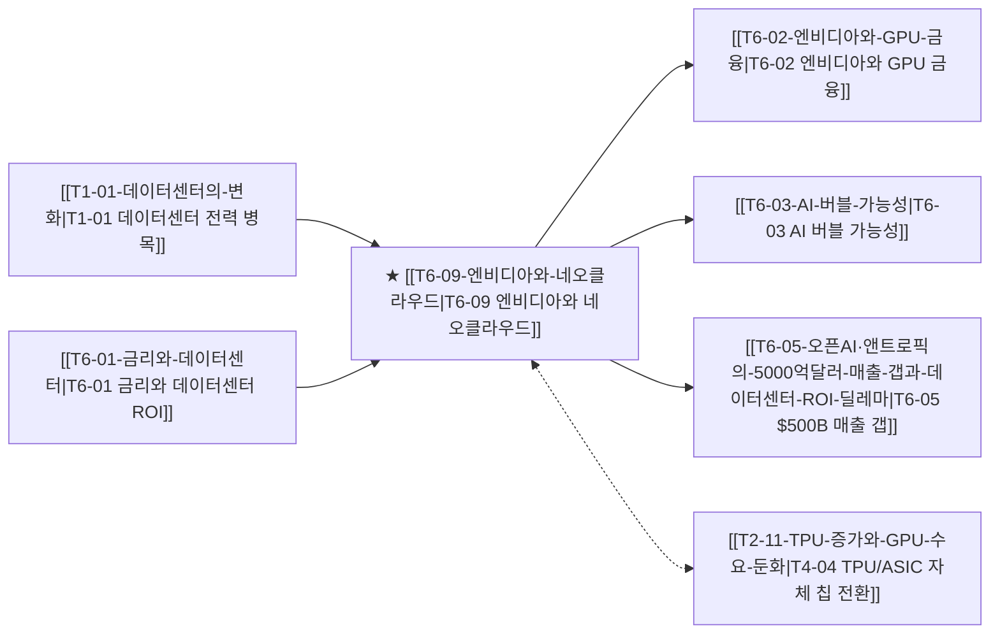

# T6-09 엔비디아와 네오클라우드

> 🧭 **상위 인덱스**: [[00-Argus-Master-MOC|Master MOC]] ➔ [[00-Argus-Master-MOC#6-🏛️-매크로-자본시장-금리--밸류에이션-t6|매크로 자본시장 & GPU 금융]]
>
> 🏷️ **교차 분석 메타데이터**:
> - **성격**: `🚀 주류 성장 (Consensus)` | **스택**: `L3 (클라우드/인프라)` | **시계**: `2026~2027`
> - **공급망 권역**: `US` | **핵심 대결 구도**: [[Vs-GPU-vs-TPU-ASIC|GPU vs ASIC]]

---

## 🎯 핵심 가설

엔비디아가 네오클라우드(CoreWeave, Lambda 등)에 차세대 GPU를 우선 배정하고 지분을 투자하는 **'GPU 혈맹 구조'**를 통해 빅테크의 자체 ASIC(TPU/Trainium) 전환을 견제하고 GPU 수요를 인위적으로 방어하고 있다. 그러나 네오클라우드의 과도한 GPU 담보 부채 레버리지는 AI CapEx 둔화 시 연쇄 부실 리스크로 연결된다.

---

## 🔗 테제 네트워크 (상호 연관 가설)



- 🔼 **선행 가설 (배경 요인 & 상위 인프라)**:
  - [[T1-01-데이터센터의-변화|T1-01 데이터센터의 변화]] — GPU 쇼티지 구간 네오클라우드 부상
  - [[T6-01-금리와-데이터센터|T6-01 금리와 데이터센터]] — 고금리 환경 속 리스/파이낸싱 비용 상승
- ➡️ **동반 및 대체·경쟁 가설**:
  - [[T2-11-TPU-증가와-GPU-수요-둔화|T2-11 TPU 증가와 GPU 수요 둔화]] — 빅테크 자체 가속기 전환에 따른 네오클라우드 의존도 확대
- 🔽 **파생 및 후행 리스크 가설**:
  - [[T6-02-엔비디아와-GPU-금융|T6-02 엔비디아와 GPU 금융]] — GPU 담보 차입금(ABS/Debt) 확대
  - [[T6-03-AI-버블-가능성|T6-03 AI 버블 가능성]] — 네오클라우드 공실률 상승 및 부실 위험
  - [[T6-05-오픈AI·앤트로픽의-5000억달러-매출-갭과-데이터센터-ROI-딜레마|T6-05 $500B 매출 갭]] — 클라우드 컴퓨트 용량 소화 지연

---

## 🏢 연관 기업 & 핵심 기술 허브
- **핵심 기업**: [[Company-NVIDIA|NVIDIA]], [[Company-CoreWeave|CoreWeave]], [[Company-Microsoft|Microsoft]], [[Company-OpenAI|OpenAI]]
- **핵심 기술/토픽**: [[Topic-ASIC|ASIC]], [[Topic-액체냉각|액체냉각]]

---

## 📑 관련 산출물 (자동 집계)

```dataview
TABLE file.mtime AS "작성일", tags AS "태그"
FROM "argus" OR "output" OR ""
WHERE contains(file.outlinks, this.file.link) OR contains(file.text, "CoreWeave") OR contains(file.text, "네오클라우드")
SORT file.mtime DESC
LIMIT 8
```
