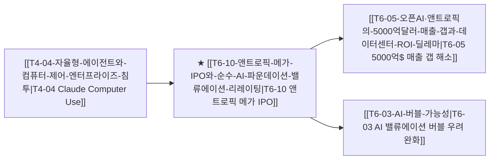

# T6-10 앤트로픽 메가 IPO와 순수 AI 파운데이션 밸류에이션 리레이팅

> 🧭 **상위 인덱스**: [[00-Argus-Master-MOC|Master MOC]] ➔ [[00-Argus-Master-MOC#6-🏛️-매크로-자본시장-금리--지정학-안보-macro--geopolitics|매크로 자본시장 & 지정학 안보]]

> 🏷️ **교차 분석 메타데이터**:
> - **성격**: `🚀 주류 성장 (Consensus)` | **스택**: `L3 (클라우드/자본시장)` | **시계**: `2026~2027`
> - **공급망 권역**: `US` | **핵심 토픽**: [[Topic-프론티어모델|프론티어모델]], [[Topic-AI에이전트|AI에이전트]]

---

## 🎯 핵심 가설
Anthropic의 사상 최대 규모 메가 IPO(S-1 상장) 추진은 비상장 벤처 밸류에이션에 갇혀 있던 프론티어 AI 랩의 공모시장 멀티플(EV/Run-rate)을 공인하는 벤치마크가 되며, 대규모 공모 자금 유입이 AWS·GCP 컴퓨트 CAPEX와 순수 AI 소프트웨어 밸류에이션의 전면적 리레이팅(Re-rating)을 견인한다.

---

## 🔗 테제 네트워크 (상호 연관 가설)



- 🔼 **선행 가설 (배경 요인 & 상위 인프라)**:
  - [[T4-04-자율형-에이전트와-컴퓨터-제어-엔터프라이즈-침투|T4-04 자율형 에이전트와 컴퓨터 제어의 침투]] — Claude 3.5 기반 B2B 엔터프라이즈 매출 폭증 실적 입증
- ➡️ **동반 및 대체·경쟁 가설**:
  - [[T4-02-AI-소프트웨어-레이어의-과점화|T4-02 AI 소프트웨어 레이어의 과점화]] — 비상장 OpenAI vs 상장사 Anthropic 간의 자본 조달력 및 상장 프리미엄 격돌
- 🔽 **파생 및 후행 병목 가설**:
  - [[T6-05-오픈AI·앤트로픽의-5000억달러-매출-갭과-데이터센터-ROI-딜레마|T6-05 5000억$ 매출 갭과 ROI 딜레마]] — 1,000억 달러 공모 자금 확보를 통한 장기 컴퓨트 PPA 및 인프라 계약 확정
  - [[T6-03-AI-버블-가능성|T6-03 AI 버블 가능성]] — 공모시장 가격 발견 기능을 통한 AI 섹터 전반의 건전한 멀티플 재평가

---

## 🏢 연관 기업 & 핵심 기술 허브
- **핵심 기업**: [[Company-Anthropic|Anthropic]], [[Company-Amazon|Amazon]], [[Company-Alphabet|Alphabet (Google)]], [[Company-OpenAI|OpenAI]], [[Company-Microsoft|Microsoft]]
- **주관 투자은행**: Morgan Stanley, Goldman Sachs, JPMorgan
- **핵심 기술/토픽**: [[Topic-프론티어모델|프론티어모델]], [[Topic-AI에이전트|AI에이전트]]

---

## 📈 지지 근거
- **S-1 비공개 제출 및 사상 최대 공모 규모**: SEC에 S-1 등록 서류를 제출하고 최대 2조 달러 가치 평가 및 1,000억 달러 조달을 목표로 IPO 추진 (역대 최대 규모 경신 유력).
- **견고한 실적 모멘텀**: 2026년 연환산 매출(Run-rate) 650억 달러 돌파 및 2026년 2분기 조정 영업이익 흑자 달성으로 순수 AI 모델사의 수익성 우려 불식.
- **클라우드 동맹 수혜**: Amazon AWS(Bedrock) 및 Google Cloud의 대규모 지분 가치 평가익 실현 및 상장 공모금을 통한 클라우드 컴퓨트 구매 재투자 순환.

---

## 📉 반박 근거
- 고금리 지속 및 기술주 공모 시장의 유동성 위축 시 목표 밸류에이션 달성 지연 가능성.
- 거대 공모 물량 출회에 따른 단기 수급 부담 및 기존 빅테크 파트너들의 지분 락업 해제 리스크.

---

## 📑 관련 산출물 (자동 집계)

### 🤖 Dataview 실시간 역방향 링크
```dataview
TABLE file.mtime AS "작성일", angle AS "관점", tags AS "태그"
FROM "argus" OR "output" OR ""
WHERE contains(thesis, "T6-10") OR contains(file.outlinks, this.file.link)
SORT file.mtime DESC
LIMIT 7
```

### 📌 수동 링크 아카이브


---

## 📝 분석가 메모
Anthropic의 상장은 'AI 파운데이션 모델사는 거대한 GPU 감가상각비로 인해 흑자를 낼 수 없다'는 시장의 회의론을 실적과 공모 시장 가격으로 정면 돌파하는 역사적 이벤트입니다. 특히 최대 주주인 Amazon(AWS)과 Google(GCP)에 막대한 지분 평가익과 장기 컴퓨트 소비 보장을 안겨주어, 빅테크 클라우드 생태계 전반의 자본 순환을 한 단계 가속화합니다.
